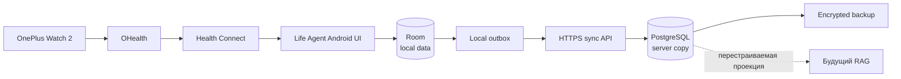

# Краткий вывод

> Статус: продукт переведён на Android-first архитектуру. Авторитетный состав
> button-first MVP без голоса и AI parsing зафиксирован в
> [Product specification](10-mvp-product-spec.md), а порядок реализации — в
> [delivery plan](11-mvp-delivery-plan.md).

## Что именно строим

Life Agent — не медицинский советчик, а персональная система достоверной памяти
для одного владельца:

```text
Android-форма или Health Connect
→ локальная транзакция
→ структурированное событие
→ исправление/отмена
→ фоновая синхронизация и backup
→ будущие представления и RAG
```

Единственный основной интерфейс — нативное Android-приложение на OnePlus Open.
В нём же находятся ручные формы, локальные справочники и чтение Health Connect.
Telegram-бот исключён из MVP и текущего roadmap: Telegram не является
ingress/transport, а отдельный Life Agent companion для capture или Health
Connect не нужен.

Целевой пользовательский опыт:

- частая запись занимает несколько нажатий и меньше 10 секунд;
- подтверждение появляется сразу после локальной durable-транзакции, даже без
  сети;
- повторная отправка, reconnect и рестарт не создают дубликатов;
- только что созданный факт можно исправить или отменить;
- любой факт можно экспортировать, а синхронизированную серверную копию —
  восстановить;
- Health Connect импортируется тем же APK с минимальными разрешениями.

## Рекомендуемый контур



Android-приложение является местом первичной записи. Сохранение не ждёт сеть:
событие и outbox-команда создаются одной Room-транзакцией. Сервер принимает
идемпотентные пакеты, хранит синхронизированную PostgreSQL-копию и формирует
backups. Стабильные event/revision ID идентифицируют ветви, но сами конфликт не
разрешают: сервер сверяет `base_revision_id`, возвращает явный `409`, а
подтверждённое разрешение создаёт новую revision со ссылками на обе ветви.

Серверная недоступность не должна блокировать ручной capture или чтение уже
локально созданных справочников. Статус sync виден отдельно и не подменяет
статус локального сохранения.

## Питание без FatSecret

Локальный каталог — основной вариант для личного сценария:

- `product` — продукт и КБЖУ на 100 г/100 мл или одну порцию;
- `food_alias` — личные названия: «моя овсянка», «тот творог»;
- `recipe_version` — версия блюда, ингредиенты, выход и число порций;
- `portion_preset` — «одна миска», «обычный завтрак», «половина пачки»;
- `consumption_event` — что и сколько фактически съедено;
- `nutrient_snapshot` — рассчитанные КБЖУ именно в момент записи.

Изменение карточки продукта или рецепта не меняет старые события. Внешний
каталог, barcode и OCR можно добавить позже как необязательные способы создать
локальную карточку, но они не являются runtime-зависимостью.

## Автоматические данные

Для текущих устройств выбран прямой Android flow:

```text
OnePlus Watch 2 → OHealth → Health Connect → Life Agent Android
```

Тот же APK запрашивает только необходимые read-permissions. Текущий M4 scope
ограничен сном и обычным пульсом (`HeartRateRecord`); Day 0 подтвердил отдельный
OHealth `RestingHeartRateRecord`, который остаётся optional/P1 задачей M4. APK
сохраняет source metadata и синхронизирует нормализованные события на сервер.
Публичный OHealth REST API не предполагается.

Day 0 на реальном телефоне подтвердил OHealth sleep sessions, ordinary HR и RHR.
Стадии сна и device metadata не наблюдались; их нельзя восстанавливать догадкой.
Respiratory rate, steps и total calories обнаружены как post-MVP discovery.
Другие wearable-типы также остаются post-MVP независимо от результата probe.

Google Fit API не используется для новой интеграции. Другие vendor/server API
рассматриваются только как post-MVP fallback, если нужных данных действительно
нет в Health Connect.

## Что является MVP

В MVP входят:

- single-user Android-приложение;
- local-first Room DB и durable outbox;
- локальные продукты, рецепты и быстрые порции;
- события питания со snapshot КБЖУ;
- настраиваемое самочувствие с timestamp и комментарием;
- справочник лекарств/БАДов и фактические приёмы;
- обычные текстовые заметки;
- исправление и отмена только что созданной записи;
- чтение сна и обычного пульса (`HeartRateRecord`) из Health Connect;
  подтверждённый RHR — отдельная optional/P1 задача M4;
- идемпотентная HTTPS-синхронизация с личным сервером;
- PostgreSQL, полный export, encrypted backup и проверка восстановления.

Не входят:

- Telegram-бот или Telegram Mini App;
- голос, ASR и agentic parsing;
- диагнозы, назначения и автоматические медицинские выводы;
- «точные» калории по фотографии без массы;
- единый readiness/health score;
- все часы и платформы сразу;
- timeline, графики и аналитический dashboard;
- RAG, embeddings и персональный коучинг;
- multi-user.

## Критерий готовности к следующему этапу

После репрезентативного dogfooding, охватившего обычные capture paths, offline
периоды, sync, corrections и recovery:

- типичный capture укладывается в несколько нажатий;
- нет потерянных подтверждённых локальных записей;
- все outbox-команды после восстановления сети доходят ровно один логический
  раз;
- импортированные дубли меньше 1%;
- экспорт можно без потерь восстановить в чистую БД;
- completeness и задержка импорта сна/обычного HR измерены на реальном
  устройстве.

Только после этого имеет смысл добавлять голосовой pipeline, расширенные
представления и RAG.
