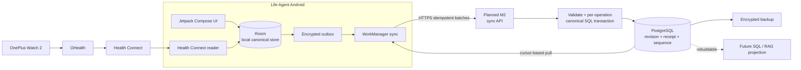
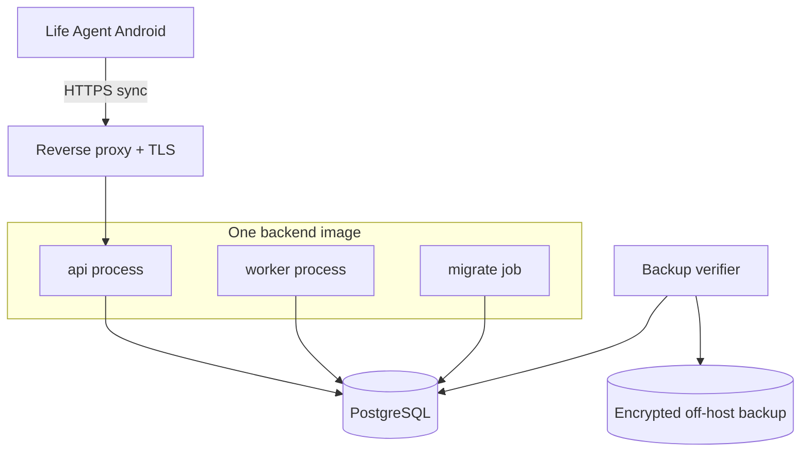

# Техническая архитектура

## Статус и границы

Статус: рекомендуемая архитектура MVP с путём к production.

Дата исследования: 27 июля 2026 года.

Система первого этапа — не медицинская информационная система и не автономный
советчик. Её задача:

```text
мгновенно сохранить ручной ввод на телефоне
→ забрать разрешённые данные из Health Connect
→ пережить отсутствие сети без потери записей
→ синхронизировать их с личным сервером
→ атомарно сохранить canonical revision на сервере
→ дать быстро исправить или отменить последнее действие
→ обеспечить export, backup и проверяемое восстановление
```

Главный архитектурный принцип — `collection first`: отсутствие сети, сбой
синхронизации или будущего необязательного обработчика не должен приводить к
потере уже сохранённой локально записи.

## Ключевое решение

MVP — **Android-first offline-first система** из одного пользовательского
приложения и небольшого серверного модульного монолита:

- один репозиторий;
- одно Android-приложение на Kotlin с Jetpack Compose как единственный интерфейс
  ввода, исправления, синхронизации и управления интеграциями;
- Room как encrypted canonical local store и durable источник новой записи до
  ACK;
- локальный encrypted outbox и WorkManager для гарантированной фоновой доставки;
- Health Connect reader внутри того же приложения, а не отдельный companion;
- планируемый в M2 HTTPS sync API на `https://life.andriyshkoy.ru`;
- PostgreSQL как canonical-хранилище всей принятой сервером истории, резервных
  копий и будущих SQL/RAG-проекций;
- процессы `api` и `migrate`, а также небольшой `worker` только для
  export/backup/purge задач, из одной backend-кодовой базы;
- идемпотентные per-operation транзакции вместо Kafka и микросервисов.

Room не конкурирует с PostgreSQL за роль глобальной истины. До первого ACK
локальная revision является единственной durable-копией пользовательского
действия. После ACK PostgreSQL хранит canonical synced history, а Room в течение
текущего MVP сохраняет полную offline-копию revisions со статусами
`active|retracted`, pending operations и текущие проекции интерфейса.

Первый запуск до enrollment создаёт в app-private storage два локальных opaque
ID: `installation_id` для этой установки APK и `local_owner_id` для единственного
локального профиля. Они позволяют сохранять captures/events/revisions полностью
offline. Выданные сервером `device_id` и `person_id` являются nullable enrichment
локальных строк и не служат prerequisite для capture; enrollment добавляет
binding, не переписывая client-generated `capture_id`, `event_id`, `revision_id`
или `operation_id`.

Полный event sourcing и CQRS в MVP не нужны. Append-only revisions и минимальный
capture/provenance ledger дают replay и audit без необходимости восстанавливать
всё текущее состояние из технического event log.

Telegram-бот для MVP отклонён: отдельный облачный интерфейс дублирует Compose UI,
хуже работает с локальными разрешениями и не даёт преимуществ для единственного
Android-пользователя. После отдельного privacy review Telegram может использоваться
только для нечувствительных исходящих уведомлений, но не для ввода, логирования
или передачи health data.

## Контекст системы



Health Connect находится на телефоне, поэтому сервер не может прочитать его
напрямую. Android-приложение получает локальные runtime permissions и переносит
изменения через encrypted outbox. Health Connect официально использует Changes
tokens и события UPSERT/DELETE:
[Health Connect sync](https://developer.android.com/health-and-fitness/health-connect/sync-data).

## Компоненты модульного монолита

### Life Agent Android

Это продуктовый интерфейс, локальное хранилище и Android-коннектор в одном APK:

- Jetpack Compose экраны и modal flows для питания, самочувствия, лекарств/БАДов,
  заметок и статуса Health Connect;
- one-tap presets и предзаполненные формы для частых продуктов, блюд и доз;
- Room entities/DAO как offline working set и `Flow`-источник UI;
- append-only локальные revisions вместо перезаписи факта;
- Health Connect permissions, initial backfill и incremental change reader;
- encrypted outbox, синхронизация через WorkManager и явная кнопка retry;
- статус `local / syncing / synced / conflict / failed` рядом с записью;
- export, delete и диагностика разрешений/синхронизации.

Навигация и формы не обращаются к сети напрямую. Use cases сначала выполняют
одну Room-транзакцию (`revision + outbox operation`), после чего UI немедленно
показывает результат. Сеть является механизмом репликации, а не условием ввода.

### Планируемый HTTPS sync API (M2)

После TLS/security gate точка `life.andriyshkoy.ru` будет обслуживать Android
sync:

- аутентифицирует зарегистрированное устройство;
- проверяет размер и техническую форму envelope;
- требует `Idempotency-Key`, в точности равный `batch_id`, и проверяет
  `capture_id`, `operation_id`, schema version, batch/operation content hashes и
  сохранённое membership;
- для каждой операции атомарно сохраняет canonical event/revision, включая
  retracted revision удаления, revision parents, допустимое изменение
  `life_event.current_revision_id`, нужную Health Connect source version,
  `sync_operation_receipt` и `server_sequence` в PostgreSQL;
- возвращает per-operation ACK и новый server cursor только после commit этой
  canonical-транзакции.

Raw/capture metadata или post-commit job могут сохраняться в той же транзакции,
но сами по себе никогда не дают ACK и не продвигают server cursor. Голос, ASR,
OCR, LLM parsing, file imports и OAuth callbacks не являются компонентами MVP.
Единственное ограниченное исключение — явный локальный JSON/CSV seed справочника
питания в M3; он не является generic file-ingestion pipeline и не создаёт
жизненные события без отдельного capture-действия.

### Blob service после MVP

Отдельный BlobStore не нужен текущим ручным и Health Connect сценариям. Он
добавляется вместе с явно одобренным media/import расширением и тогда хранит:

- voice и исходные изображения;
- точные большие API responses;
- импорты и экспорты;
- сырые waveform chunks;
- при необходимости полные model inputs/outputs.

Приложение работает через интерфейс `BlobStore`, а не через vendor-specific SDK
во всех доменных модулях. Для одного сервера достаточно отдельного локального
filesystem volume; S3-compatible backend добавляется без изменения
canonical-схемы, если уже есть MinIO/S3 или нужен отдельный storage host.

Каждый blob получает новый opaque key. Перезапись существующего key запрещена.
В PostgreSQL сохраняются object version, MIME, размер, cryptographic checksum и
encryption metadata.

### Durable jobs и workers

MVP worker выполняет только не влияющие на ACK задачи export, backup verification
и controlled purge. Если им нужна очередь, достаточно PostgreSQL-backed
`outbox_job`:

- lease с `locked_until`;
- `SELECT ... FOR UPDATE SKIP LOCKED`;
- bounded retry с exponential backoff и jitter;
- dead-letter state;
- ручной replay после исправления причины.

Redis можно добавить как accelerator, но он не должен быть единственным местом,
где существует непринятая работа. Kafka или отдельный workflow engine для одного
пользователя преждевременны.

Текущие job types:

```text
export.build
backup.verify
purge.execute
```

Canonical materialization выполняется до ACK внутри per-operation SQL
transaction, а не worker job.

### Artifact pipeline после MVP

Голосовой/медийный pipeline не входит в MVP. Если он будет отдельно одобрен,
каждый этап принимает immutable input и создаёт новый immutable artifact:

```text
voice file
→ raw ASR response
→ transcript
→ extracted candidates
→ validated candidates
→ canonical revisions
```

Для `processing_run` фиксируются:

- stage и pipeline version;
- input artifact IDs и hashes;
- модель, версия модели и runtime;
- prompt/schema/config hash;
- start/end time, status и ошибка;
- output artifact IDs.

Повтор этапа с тем же `input_hash + stage + config_version` идемпотентен.
Обновление parser не переписывает старый transcript: оно создаёт новую ветку
artifacts, которую можно сравнить с предыдущей.

### Canonical service

Отвечает за:

- стабильные identity жизненных событий;
- append-only revisions;
- typed observations;
- связи между событиями;
- user corrections и source retractions;
- optimistic concurrency;
- текущие SQL views.

### Read models и будущие проекции

В MVP нужны только read models для подтверждения последнего действия,
bootstrap/incremental pull и export. Полная timeline, dashboard, графики и
аналитика не входят в продуктовый интерфейс MVP.

После MVP из тех же revisions можно добавить дневные/недельные агрегаты,
полнотекстовый поиск, FHIR/Open mHealth views и документы/embeddings для RAG.

Projection никогда не является единственной копией факта и должна
перестраиваться из canonical revisions.

### Cloud connector scheduler после MVP

Health Connect читается приложением на телефоне и не требует серверного
scheduler. Отдельный cloud connector появляется только при доказанном пробеле
Health Connect и тогда планирует:

- прямые cloud sync;
- refresh OAuth tokens;
- sliding-window reconciliation;
- retries по `Retry-After`;
- freshness checks.

Состояние каждого data type хранится отдельно, чтобы отзыв одного разрешения не
ломал остальные потоки.

## Слои данных

MVP реализует capture/provenance, canonical revisions и минимальные read models.
Artifact DAG и медийные blobs ниже являются зарезервированным post-MVP
расширением, а не текущим runtime-компонентом.

### 1. Raw

Raw — точное свидетельство полезного входа, но не обязательная копия всего
сетевого пакета:

- исходный form command или Health Connect source record;
- transport headers, необходимые для аудита, без секретов;
- source account, external identifiers и version;
- timestamps источника и получения;
- content hash и, только после появления media/import feature, ссылка на blob;
- тип операции `UPSERT` или `DELETE`.

Raw записи не обновляются обычным application flow. Повторная доставка
регистрируется как отдельный delivery attempt, но не создаёт второй source fact.
Служебные Android/HTTP headers и идентификаторы, не нужные для provenance, не
сохраняются. Полный ответ внешнего API хранится только если это допускают его
условия и выбранная retention policy; иначе сохраняются необходимые source
records, hashes и provenance.

`capture_id` создаётся в момент ручного или Health Connect capture и проходит без
замены через Room capture/revision, outbox operation, HTTP envelope,
`raw_ingest`, operation receipt и canonical provenance. Один capture может
породить несколько events, но retry никогда не создаёт для него новый
`capture_id`.

`Immutable` не означает `undeletable forever`: действия `Удалить период` и
`Удалить все данные` должны выполнять контролируемый purge/crypto-erasure. S3
Object Lock/WORM не следует включать по умолчанию, поскольку он мешает праву
пользователя удалить данные. Семантика Object Lock описана в
[официальной документации S3](https://docs.aws.amazon.com/AmazonS3/latest/userguide/object-lock.html).

### 2. Artifact после MVP

Artifact — результат технического преобразования:

- audio/image file;
- ASR transcript;
- OCR output;
- source-specific mapped JSON;
- LLM extraction response;
- validation report.

Artifacts образуют DAG через `artifact_edge`. Это позволяет ответить:

- из какого аудио получен факт;
- какой transcript использовал parser;
- какой model/config создал поле;
- что требуется пересчитать после correction.

### 3. Canonical

Canonical слой содержит пригодные для запросов факты:

- `life_event` — стабильная identity;
- `event_revision` — версия;
- `observation_value` — типизированное измерение;
- доменные child records;
- field-level evidence;
- event relations.

Canonical revision не изменяется после создания. Текущая версия — маленькая
mutable projection: `life_event.current_revision_id` и SQL view.
Она не вычисляется по максимальному `revision_no` или времени. Pointer может
указывать на revision с `record_status = active` либо `retracted`; canonical
термин `tombstone` означает именно retracted revision, и тогда current view
скрывает логическое событие, сохраняя его history.

### 4. Projection

Проекции включают:

- current facts;
- nutrient snapshots;
- bootstrap/pull и export views;
- после MVP — локальные календарные дни, дневные rollups, search documents и
  RAG chunks/embeddings.

У каждой проекции есть `projection_version`, `source_revision_ids` и checkpoint.

## Прагматичная модель PostgreSQL

### Ingestion и lineage

```text
device
  device_id, person_id, status, enrolled_at, revoked_at

device_session
  device_session_id, session_family_id, device_id
  status, created_at, revoked_at, revoke_reason

device_session_token
  token_id, session_family_id, token_kind (access / refresh)
  token_hash, generation, expires_at
  spent_at, replaced_by_token_id, reuse_detected_at, revoked_at

sync_batch
  device_id, batch_id, content_sha256, received_at

sync_batch_operation
  device_id, batch_id, operation_id, ordinal, operation_content_sha256

sync_operation_receipt
  person_id, device_id, operation_id, batch_id
  capture_id, event_id, revision_id, content_sha256
  result_code (applied / conflict), server_sequence, committed_at

raw_ingest
  raw_ingest_id, capture_id, person_id, connector_account_id, device_id
  transport, idempotency_key (= batch_id), operation_id, batch_id
  received_at, payload_inline, blob_id, content_sha256

delivery_attempt
  delivery_attempt_id, raw_ingest_id, attempt_no
  received_at, transport_metadata

source_record_version
  source_record_version_id, connector_account_id, stream_key
  external_id, external_version, operation
  source_created_at, source_modified_at
  raw_ingest_id, payload_hash

outbox_job
  outbox_job_id, job_type, status
  available_at, locked_until, attempt_count, payload

purge_ledger
  purge_generation, purge_id, scope_encrypted, scope_digest
  requested_at, completed_at

purge_watermark
  target_kind, target_id, applied_generation, applied_at

backup_manifest
  backup_id, snapshot_id, purge_generation, manifest_sha256, created_at
```

Post-MVP media/processing extension:

```text
blob
  blob_id, object_key, object_version, media_type, size
  plaintext_sha256, ciphertext_sha256, encryption_key_ref

artifact
  artifact_id, kind, schema_version, inline_value_or_blob_id, content_hash

artifact_edge
  parent_artifact_id, child_artifact_id, relation

processing_run
  stage, pipeline_version, model, config_hash
  status, error_code, started_at, finished_at
```

### Canonical events

```text
life_event
  event_id, person_id, event_kind, current_revision_id

event_revision
  revision_id, event_id, person_id, capture_id, revision_no, schema_version
  assertion_status          observed / uncertain
  lifecycle                 NULL
  record_status             active / retracted
  verification_status       source_recorded / user_confirmed /
                            machine_inferred / needs_review
  effective_start_utc, effective_end_utc
  original_local_start, original_local_end
  timezone_id, start_offset_seconds, end_offset_seconds
  temporal_precision, local_date
  recorded_at, created_at
  actor_type, correction_reason
  payload jsonb, quality_flags

revision_parent
  child_revision_id, parent_revision_id
  relation                  supersedes / resolves
```

В MVP используются фактические `meal`, `wellbeing`, `medication_intake`,
`supplement_intake`, `note`, `sleep` и `measurement`: для них
`assertion_status` равен `observed` либо `uncertain`, а `lifecycle` равен
`NULL`. Статусы `planned`/`negated` и lifecycle
`scheduled`/`completed`/`cancelled` зарезервированы для post-MVP: выполненный
факт остаётся отдельным событием. MVP constraint запрещает non-NULL lifecycle;
future schema version вводит planned event type и допустимые transitions вместе.
Обычная correction имеет одного parent с relation `supersedes`; resolution
конфликта имеет две parent-связи `resolves`, поэтому ни одна ветка не теряется.
`revision_no` может совпасть у двух branches и не является identity; ancestry
задаёт `revision_parent`, identity задаёт `revision_id`.

### Measurements

```text
observation_value
  observation_value_id, person_id, event_revision_id, concept_id
  value_numeric | value_code | value_text | value_boolean
  comparator
  raw_value_numeric, raw_unit_text
  canonical_value_numeric, ucum_code
  unit_display, conversion_version
  statistic, aggregation_period
  method, body_site, device_id
  source_quality, quality_flags
```

`CHECK` constraint должен разрешать ровно один основной typed value. Для
финансово- и health-подобных величин используется decimal/numeric, а не binary
float.

### Evidence и relations

```text
assertion_evidence
  assertion_evidence_id, person_id, event_revision_id, capture_id
  field_path
  source_record_version_id
  locator_json
  modality
  time_confidence
  unit_confidence
  human_confirmed

post-MVP evidence extension
  assertion_evidence_id, artifact_id
  extraction_confidence, processing_run_id

event_relation
  from_event_id, to_event_id
  relation: part_of / derived_from / same_as
```

Один ручной ввод, а после MVP — голосовая заметка или imported record, может
породить несколько событий; одно событие также может иметь несколько
свидетельств. Поэтому provenance — many-to-many, а не один `source_id` в событии.

`fulfills_plan` добавляется в `event_relation` только вместе с отдельным
post-MVP доменом планов.

### Concepts и mappings

```text
concept
  id, local_code, display
  value_type, canonical_ucum_unit
  external_code_system, external_code

concept_mapping
  source_system, source_code
  concept_id, mapping_version, transform
```

Локальный `concept_id` остаётся стабильным. LOINC, Open mHealth, Health Connect
и vendor codes являются mappings, а не primary keys приложения.

### Connectors

```text
connector_account
  connector_account_id, person_id, connector_type, status
  scopes, credential_secret_ref
  last_success_at, last_error

sync_stream
  sync_stream_id, connector_account_id, stream_key
  cursor_or_anchor_secret_ref
  cursor_expires_at
  high_watermark_time, overlap_window
  last_attempt_at, last_success_at
  lease_until, status, last_error

sync_run
  sync_run_id, sync_stream_id, started_at, finished_at
  input_cursor_hash, output_cursor_hash
  page_count, record_count, status
```

## Надёжный offline-first flow

### Ручное действие в Android UI

```text
1. ViewModel передаёт typed command в domain use case.
2. Use case создаёт capture_id, event_id, revision_id и operation_id на телефоне.
3. Одна Room-транзакция сохраняет local capture, event/revision и encrypted
   outbox operation под installation_id/local_owner_id; server device/person
   enrichment может ещё быть NULL.
4. Compose получает новое состояние через Flow и показывает запись немедленно.
5. Unique WorkManager job с NetworkType.CONNECTED создаёт durable bounded batch:
   batch_id, canonical body bytes/hash и упорядоченное membership operation_id.
6. API применяет каждую операцию отдельной атомарной PostgreSQL-транзакцией:
   canonical event/revision (`active` либо `retracted`), receipt и server sequence.
7. Только после commit конкретной операции API возвращает её terminal ACK;
   Android атомарно отмечает outbox row как `synced` либо `conflict` согласно
   сохранённому `result_code`.
8. Приложение забирает server changes после своего cursor и обновляет Room.
```

Закрытие приложения, перезагрузка телефона и отсутствие сети между любыми
шагами не теряют факт. HTTP `Idempotency-Key` в точности равен `batch_id`.
Byte-identical retry читает сохранённые body bytes/hash и membership прежнего
batch, а не сериализует его заново. После частичного ACK новый durable batch
может включить только непринятые `operation_id`; per-operation identity и receipt
остаются привязаны к `operation_id + content hash`. Удалять payload из outbox до
серверного ACK нельзя. WorkManager не обещает точного времени запуска, поэтому
экран также предлагает безопасный ручной sync.

После ACK короткий TTL может удалить только delivery rows/payload
`sync_outbox/local_sync_batch`; local captures, events и полная revision history
`active|retracted` остаются в Room весь текущий MVP.

Commit только raw metadata, delivery attempt или `outbox_job` не является
принятием операции: в этом случае ACK и новый cursor не возвращаются.
Невалидная операция также получает error без receipt/ACK; canonical-committed
conflict branch получает terminal ACK с `result_code = conflict`, но не меняет
`life_event.current_revision_id`. Такой conflict принят в canonical history, а
не rejected; отдельная resolution revision позже может передвинуть pointer.

Identity names не взаимозаменяемы: `capture_id` обозначает provenance envelope,
`operation_id` — одну идемпотентно доставляемую команду, `event_id` — logical
event, а `revision_id` — его immutable версию. Retry сохраняет все эти IDs и
никогда не создаёт новый `event_id` вместо `operation_id`.

### Health Connect capture

```text
1. Приложение читает страницу изменений по Health Connect changes token.
2. В одной Room-транзакции сохраняет source UPSERT/DELETE versions,
   соответствующие active/retracted revisions, outbox operations и новый changes
   token.
3. После локального commit можно читать следующую страницу независимо от сети.
4. WorkManager доставляет накопленные операции обычным HTTPS sync flow.
5. Истёкший token запускает ограниченный lookback и source-aware reconciliation.
```

Changes token продвигается после durable local persistence, а не после network
ACK: Room уже является защищённой от временного offline-копией. При очистке
данных приложения эта гарантия исчезает, поэтому PostgreSQL backup и понятный
re-enrollment обязательны.

### Device enrollment и аутентификация

Первичная привязка не вшивает постоянный secret в APK:

```text
1. До сети приложение уже имеет installation_id/local_owner_id и может писать
   локальную историю.
2. На сервере создаётся одноразовый enrollment code с коротким TTL; хранится hash.
3. Пользователь вводит/сканирует code в приложении по HTTPS.
4. Сервер связывает installation с device_id/person_id и выдаёт opaque
   short-lived access token и rotating refresh token.
5. Refresh token сохраняется на телефоне только как Keystore-wrapped ciphertext;
   access token остаётся в памяти либо при необходимости также сохраняется
   wrapped до expiry. На сервере оба существуют только как hashes в одной session
   family с expiry/generation state.
6. Sync request несёт Bearer access token, device_id,
   Idempotency-Key = batch_id и body hash.
7. Revoke отзывает session family устройства без удаления уже принятых facts.
```

Refresh выполняется single-flight и атомарно помечает использованный refresh hash
как `spent`, создавая successor в той же `session_family_id`. Повторное
использование spent refresh token фиксирует reuse и отзывает всю family вместе
со всеми access/refresh hashes; каждый API request проверяет expiry и family
revocation. Spent refresh hashes сохраняются до окончания family/reuse window,
чтобы replay оставался обнаружимым. TLS обязателен; plaintext access/refresh
tokens, enrollment code и health payload никогда не попадают в БД, logs, backups
или crash reports.

В security boundary владелец называется `subject_id`, а в PostgreSQL
соответствующий внутренний FK — `person_id`; в single-user MVP это стабильное
отношение 1:1. Ни `subject_id`, ни `person_id` клиент не выбирает и не передаёт в
capture payload: API выводит `person_id` только из аутентифицированной
device-session и отклоняет попытку подмены ownership.

### Cloud connector после MVP

```text
1. Получить lease на один sync_stream.
2. Прочитать страницу по cursor.
3. Сохранить разрешённые source records или exact response в blob storage
   согласно retention policy поставщика.
4. В одной SQL-транзакции:
   - зарегистрировать blob и source record versions;
   - создать outbox jobs;
   - записать next cursor.
5. COMMIT.
6. Перейти к следующей странице.
```

Cursor продвигается после durable raw persistence, а не после canonical parsing.
Parser можно переиграть позже. Это post-MVP vendor cursor, а не Android ACK или
mobile server cursor; правила ACK выше от него не меняются.

Crash после object upload, но до SQL commit, оставит orphan blob. Это безопаснее,
чем потеря страницы; периодический garbage collector удаляет unreferenced blobs
после grace period.

Если API не поддерживает cursor:

- сохраняется high-watermark;
- каждое чтение включает overlap window;
- работает source-aware deduplication;
- периодически выполняется более глубокий reconciliation.

## Идемпотентность и дедупликация

Exactly-once между внешними системами недостижим и не нужен. Используется
at-least-once delivery плюс уникальные ключи.

### Transport duplicates

- transport batch: отдельная `sync_batch` с
  `UNIQUE(device_id, batch_id)` и неизменяемым `content_sha256`;
- membership операции в batch: отдельная `sync_batch_operation` с
  `UNIQUE(device_id, batch_id, operation_id)` и
  `UNIQUE(device_id, batch_id, ordinal)`;
- отдельная операция: `(person_id, operation_id)`;
- создание события: global `event_id`;
- immutable revision: global `revision_id`;
- connector page: `(sync_stream_id, input_cursor_hash, page_hash)`.

На Android durable `local_sync_batch` хранит `batch_id`, точные canonical body
bytes и `content_sha256`, а `local_sync_batch_operation` — `operation_id`,
`ordinal` и operation content hash. В HTTP
`Idempotency-Key = batch_id`; batch identity не заменяет per-operation identity.
Совпавший batch ID с другим body hash/membership является protocol/security
error.

### Версии source record

- `(connector_account_id, stream_key, external_id, external_version)`;
- если version отсутствует:
  `(connector_account_id, stream_key, external_id, payload_hash)`;
- Health Connect deletion сохраняется как новая source
  `operation = DELETE` version того же
  `(data_origin, record_type, source_record_id)` и создаёт canonical retracted
  revision только по правилам current pointer.

### Конфликты Room ↔ PostgreSQL

UUID/UUIDv7 создаются на клиенте, поэтому retry не получает новую identity.
Каждая пользовательская correction несёт `base_revision_id`:

- если base совпадает с серверной current revision, новая immutable revision
  вместе с receipt принимается одной транзакцией, после commit сервер назначает
  ей монотонный `server_sequence` и возвращает ACK;
- если `revision_id` и content hash уже известны, сервер возвращает прежний ACK;
- если `revision_id` совпал, а hash отличается, это protocol/security error, а
  не update;
- если base устарел, сервер в одной транзакции сохраняет входящую revision как
  non-current canonical branch, её parent к stale base и receipt с
  `result_code = conflict`; только после commit возвращает terminal conflict
  ACK вместе с revision, на которую указывает
  `life_event.current_revision_id`. Конфликтная operation canonical-committed и
  не является rejected. Android показывает обе версии и
  создаёт отдельную resolution revision, ссылающуюся на обе через две строки
  `revision_parent(relation = resolves)`;
  health/medication значения нельзя разрешать молчаливым last-write-wins;
- source updates одного Health Connect record разрешаются по source version или
  `source_modified_at + payload_hash`; deletion остаётся source DELETE/retracted
  revision;
- `server_sequence` задаёт порядок sync, но не заменяет effective event time.

В single-user/single-device MVP конфликт редок, но протокол не должен зависеть
от этого предположения. Одинаковые блюда, принятые лекарства или заметки в
разное время являются разными `event_id`, даже если payload совпадает.

### Semantic overlap

Одинаковые по смыслу данные из разных источников не удаляются автоматически.
Система создаёт `same_as` cluster и выбирает representative только в проекции.

Merge policy учитывает:

- исходное приложение и промежуточный collector отдельно;
- device;
- point, interval или aggregate;
- raw sample против daily total;
- method и granularity;
- source modification time;
- ручное подтверждение.

Нельзя суммировать шаги из aggregate и raw samples или один record, зеркально
прошедший `vendor → Health Connect → Life Agent`.

Content hash не является event identity: пользователь может сознательно
сохранить две одинаковые заметки как разные события.

## Время и календарные дни

PostgreSQL `timestamptz` хранит instant, но не сохраняет исходный IANA timezone.
Для каждого события нужны:

- `effective_start_utc` и, для interval, `effective_end_utc`;
- `start_offset_seconds` и отдельный `end_offset_seconds` для interval;
- IANA `timezone_id`, например `Asia/Novosibirsk`;
- `original_local_start` и, для interval, `original_local_end`;
- temporal precision;
- при необходимости `tzdb_version`.

Для point event `end_*` поля равны `NULL`. Для interval оба offset обязательны и
сохраняются из source отдельно: `end_offset_seconds` нельзя молча копировать из
начала, потому что interval может пересечь DST или смену timezone.

Различаются:

- `effective/observed_at` — когда произошло;
- `source_created_at`;
- `source_modified_at`;
- `recorded_at` — когда пользователь сообщил;
- `ingested_at` — когда backend принял.

Если известно только `сегодня` или `утром`, нельзя подставлять фиктивную
полночь. Хранятся `local_date`, part-of-day и precision.

Для DST:

- неоднозначный fold требует сохранения выбранного start/end offset;
- несуществующее время в gap помечается flag и уточняется;
- elapsed duration считается по UTC;
- wall-clock duration при необходимости хранится отдельно.

При путешествии timezone события берётся из source/device context, а не из
текущей настройки профиля. Сон хранится реальным interval; правило «день
засыпания» или «день пробуждения» является версионированной projection policy.

Форматы и правила:
[RFC 3339](https://www.rfc-editor.org/rfc/rfc3339.html),
[RFC 9557](https://www.rfc-editor.org/rfc/rfc9557.html),
[IANA Time Zone Database](https://www.iana.org/time-zones).

## Единицы

Исходное значение нельзя заменять результатом конвертации. Хранятся:

```text
raw_value + raw_unit_text
canonical_value + case-sensitive UCUM code
localized unit_display
conversion_version
```

Типичные UCUM codes:

- `kg`, `cm`, `kg/m2`;
- `/min`;
- `mm[Hg]`;
- `Cel`;
- `%`;
- `mmol/L`, `mg/dL`;
- `s`, `min`, `h`;
- `kcal`, `m`, `km`.

Для субъективных шкал используется локальный code system и `scale_version`, а
не физическая единица.

Источники:
[UCUM Specification 2.2](https://ucum.org/ucum),
[FHIR Quantity](https://hl7.org/fhir/R4/datatypes.html#Quantity).

## Provenance, confidence и corrections

Отдельно фиксируются:

- modality: `self_reported`, `sensed`, `imported`, `derived`;
- origin system, collector и конкретный device;
- time и unit confidence;
- human confirmation;
- evidence locator;
- transform/model version;
- quality flags.

Будущий ASR/extraction pipeline хранит свои confidence отдельно и не усредняет
их в одно псевдоточное число. В MVP доза лекарства, единица и другие критичные
поля проходят явную validation до сохранения.

Correction flow:

```text
expected current revision
→ новая event_revision
→ одна либо две revision_parent связи
→ human provenance
→ update current_revision pointer
→ sync receipt + server sequence
→ COMMIT, затем ACK
```

Старая revision остаётся доступной для audit. Connector update тоже создаёт
revision. Connector deletion создаёт revision с
`record_status = retracted` и допустимо меняет current pointer, но не должен
молча уничтожать локально подтверждённый override.

## Стандарты на границе системы

### Open mHealth и IEEE 1752.1

Полезно заимствовать:

- `header + body`;
- versioned schema ID;
- UUID;
- различие `sensed` и `self-reported`;
- source creation time;
- effective time frame;
- data point и data series.

Для новых sleep/activity mappings предпочтителен опубликованный IEEE 1752.1.
Open mHealth остаётся полезным источником семантики для поддержанных измерений.
P1752.2 для cardiovascular/respiratory/metabolic measures пока является
разрабатываемым проектом, поэтому на него нельзя завязывать canonical schema.

Источники:

- [Open mHealth schemas](https://github.com/openmhealth/schemas)
- [IEEE 1752.1-2021](https://standards.ieee.org/ieee/1752.1/6982/)
- [IEEE Data Point](https://w3id.org/ieee/ieee-1752-schema/data-point.json)
- [IEEE Data Series](https://w3id.org/ieee/ieee-1752-schema/data-series.json)
- [IEEE Header](https://w3id.org/ieee/ieee-1752-schema/header.json)
- [P1752.2 status](https://standards.ieee.org/ieee/1752.2/10610/)

### FHIR R4 export

FHIR не является внутренней OLTP-моделью. Первый export profile можно строить на
FHIR R4:

- `Observation` — вес, пульс, давление, SpO₂, температура, glucose и HRV;
- `QuestionnaireResponse` — версионированные check-ins и валидированные анкеты;
- `Provenance` — import, algorithm, device/user и correction;
- `Device` — конкретные часы, весы или тонометр;
- LOINC mappings — для распространённых clinical observations;
- UCUM — для units.

Питание, произвольный дневник, будущие планы и остальные life events не следует
искусственно превращать в `Observation`.

Источники:

- [FHIR R4 Observation](https://hl7.org/fhir/R4/observation.html)
- [FHIR Vital Signs](https://hl7.org/fhir/R4/observation-vitalsigns.html)
- [QuestionnaireResponse](https://hl7.org/fhir/R4/questionnaireresponse.html)
- [Provenance](https://hl7.org/fhir/R4/provenance.html)
- [Device](https://hl7.org/fhir/R4/device.html)
- [Personal Health Device IG](https://hl7.org/fhir/uv/phd/)
- [LOINC introduction](https://loinc.org/start)

## Выбор хранилищ

### PostgreSQL — сразу

После серверного ACK PostgreSQL является source of truth для synced history:

- canonical events и revisions;
- measurements;
- Health Connect source UPSERT/DELETE versions и canonical active/retracted
  revisions;
- committed operation receipts и server sequence;
- export/backup state.

ACK подтверждает именно atomic commit canonical revision и receipt. Raw metadata,
jobs и перестраиваемые проекции могут сохраняться дополнительно, но не являются
основанием ACK.

До ACK единственная durable-копия новой Android-записи находится в Room/outbox;
это явно отражается статусом `local` или `pending`, а не скрывается от
пользователя.

Minute-level heart rate — около 526 тысяч строк в год. Для одного пользователя
обычный PostgreSQL справится с этим много лет. В начале достаточно B-tree
индексов и нескольких целевых JSONB/GIN индексов.

Документация PostgreSQL рекомендует partitioning прежде всего для действительно
больших таблиц; преждевременное разбиение увеличивает operational complexity:
[PostgreSQL partitioning](https://www.postgresql.org/docs/current/ddl-partitioning.html).

JSONB используется для версионированных расширений, но часто фильтруемые поля
остаются typed columns:
[PostgreSQL JSON](https://www.postgresql.org/docs/current/datatype-json.html).

### TimescaleDB — после benchmark

TimescaleDB имеет смысл, когда:

- накопились десятки миллионов scalar samples;
- time-bucket queries не укладываются в SLO;
- нужны compression, retention и continuous aggregates;
- сохраняется 1 Hz telemetry на годы.

Только плотная `observation_sample` становится hypertable. Life events,
revisions, provenance и connector state остаются обычными таблицами.

Нужно учитывать:

- extension upgrade и выбранную лицензию;
- размер chunks;
- late corrections и backfill;
- координацию retention с refresh windows.

Неверная retention policy может удалить данные continuous aggregate при
последующем refresh:
[hypertables](https://docs.timescale.com/use-timescale/latest/hypertables/),
[continuous aggregates](https://docs.timescale.com/use-timescale/latest/continuous-aggregates/about-continuous-aggregates/),
[retention caveat](https://docs.timescale.com/use-timescale/latest/data-retention/data-retention-with-continuous-aggregates/),
[TimescaleDB editions](https://docs.timescale.com/about/latest/timescaledb-editions/).

### Waveforms — blob storage

ECG, PPG и accelerometer высокой частоты не нужно превращать в миллиарды обычных
event rows. Они сохраняются chunked Parquet/binary blobs. В PostgreSQL остаются:

- start/end;
- sample rate и channel list;
- source/device;
- format/schema version;
- blob/hash;
- вычисленные features и summaries.

### pgvector — позже

Embeddings — перестраиваемая проекция:

```text
rag_document
  document_id, render_version
  source_event_revision_ids
  text, metadata

embedding
  document_id
  model, dimensions, embedding_version
  vector, created_at
```

До большого корпуса достаточно exact vector search. HNSW/IVFFlat являются
approximate и меняют recall; HNSW быстрее, но требует больше памяти и дольше
строится:
[pgvector](https://github.com/pgvector/pgvector).

## Backup, restore и retention

Backup считается готовым только после успешного restore в чистое окружение.

### Что резервируется

- PostgreSQL base backup и WAL/PITR либо эквивалентный consistent backup;
- после появления post-MVP BlobStore — все referenced blobs/object versions и
  manifest `DB snapshot ↔ blob checksums`;
- зашифрованная конфигурация без plaintext secrets;
- migrations и schema versions;
- device enrollment metadata и credential revocation state для reconnect.

Каждый backup manifest неизменно связывает backup ID/DB snapshot с
`purge_generation` на момент snapshot. Отдельный encrypted durable
`purge_ledger` имеет hash-chained off-host копию, не откатываемую вместе с
восстанавливаемой PostgreSQL, переживает срок жизни backup и выдаёт монотонную
generation;
`purge_watermark` фиксирует последнюю применённую generation для primary,
projection, blob/export и restore target. При restore сначала проверяется binding
manifest, затем применяются все ledger entries новее snapshot generation до
актуального watermark, и только после этого API может быть открыт. Это не даёт
старому backup воскресить физически удалённые данные.

### Рекомендуемый режим для MVP

- ежедневный encrypted database backup;
- после появления BlobStore — incremental blob backup;
- одна off-host/offline копия;
- автоматическая checksum verification;
- ежемесячный restore drill;
- понятная команда полного JSON/CSV export.

Один сервер, один диск и MinIO-контейнер на том же диске не являются backup.

Для будущего media pipeline raw media retention настраивается отдельно от
canonical facts. Удаление должно охватывать primary storage, projections и
backups по опубликованной retention policy.

## Future RAG

RAG не должен считать числовые метрики:

```text
«сколько я спал?»              → SQL interval aggregation
«средний пульс за неделю?»     → SQL/time-series query
«когда я чувствовал похожее?»  → full-text/vector retrieval
```

Порядок retrieval:

1. отфильтровать `person_id`, domain, time range и current revisions;
2. исключить retracted/superseded data;
3. использовать structured SQL для чисел;
4. объединить full-text и vector search для narrative;
5. вернуть ссылки на event revision и evidence;
6. явно отметить missing, inferred и derived fields.

`daily_fact` строится детерминированно. `daily_narrative` может строиться моделью,
но содержит model/prompt version и source revision IDs.

Correction создаёт `projection.invalidate`. При смене embedding model новая
версия строится параллельно; canonical data не меняется.

Raw payload и внешние документы считаются недоверенным контентом. Будущий агент
не получает право выполнять tool calls или менять данные только потому, что
такая инструкция встретилась внутри заметки.

## Рекомендуемый стек

Конкретные версии фиксируются после первого working spike и обновляются
отдельным dependency policy.

### Backend

- Python;
- FastAPI для device enrollment, mobile sync, readiness и export endpoints;
- Pydantic для versioned transport/domain contracts;
- SQLAlchemy 2 и Alembic;
- PostgreSQL;
- PostgreSQL `outbox_job` только для export/backup/purge задач;
- JSON Schema validation для domain payloads;
- стандартные `logging` + OpenTelemetry-compatible traces/metrics.

Python выбран за компактный typed API/data stack и зрелую поддержку PostgreSQL;
это не означает необходимость строить AI-платформу.

### Android application

- Kotlin, Jetpack Compose и Material 3;
- ViewModel + unidirectional state flow;
- Room и migrations для локальной canonical/cache-модели;
- Health Connect stable SDK с read-only permissions в первой версии;
- WorkManager для unique constrained sync и catch-up;
- Retrofit/OkHttp либо эквивалентный typed HTTPS client;
- encrypted outbox; ключ шифрования данных обёрнут Android Keystore;
- client-generated event/revision/operation IDs;
- минимальный diagnostics/export экран без зависимости от backend UI.

### Deployment

- Docker Compose для single-host MVP;
- reverse proxy с TLS для Android sync;
- containers/processes из одного backend image: `api`, `worker` и одноразовый
  `migrate`;
- PostgreSQL на отдельном persistent volume;
- отдельный backup job с удалённым target;
- secrets через mounted secret files или secret manager, не `.env` в backup.

Не следует хранить PostgreSQL и единственную backup-копию на одном
неизбыточном диске.

## Deployment layout



На 27 июля 2026 года TLS bootstrap уже публичен: отдельный валидный сертификат
обслуживает `https://life.andriyshkoy.ru/healthz`. Это ещё не M2 API:
`/api/v1/` остаётся `404` до прохождения M2 gate. В целевом M2 deployment
публичен только reverse proxy, PostgreSQL не публикует ports, а Android обращается
к versioned routes под `https://life.andriyshkoy.ru/api/v1/`; health endpoint без
TLS не поддерживается.

## Security boundaries

Минимальные требования архитектуры:

- одноразовый device enrollment, rotating refresh token и revoke;
- access-token auth, replay protection, rate/body-size limits;
- Room в app-private storage, backup health-БД средствами ОС отключён;
- Android Keystore для ключа encrypted database/credentials/outbox; secrets не в
  APK;
- отдельные service DB roles;
- шифрование диска и encrypted backups;
- envelope encryption connector credentials;
- secrets не попадают в logs, artifacts и object keys;
- authenticated mobile batches и operation-level replay protection;
- `person_id` во всех фактах, даже пока пользователь один;
- application audit для export/delete/connect/disconnect;
- явные экраны privacy/export/delete-period/delete-all;
- RLS можно включить до multi-user, но оно не заменяет правильные service roles.

Скрытие Android UI за биометрией опционально и не заменяет device encryption.
Background sync должен иметь доступ к ключу без интерактивной биометрии, поэтому
отдельный Keystore key с корректной unlock policy нужен именно для outbox.

## Наблюдаемость и целевые SLO

Нужны технические метрики:

- ingress commit latency;
- Android outbox age и число pending/conflict operations;
- время последней успешной push/pull синхронизации;
- operation-to-canonical commit latency;
- job queue age, retries и dead-letter count;
- connector freshness по stream;
- duplicate/equivalence clusters;
- projection checkpoint lag;
- backup age и last successful restore.

Практичные MVP-цели:

- ни одной потерянной Room-committed или ACK-confirmed записи;
- p95 ingress commit меньше 500 мс на локальном сервере;
- ручной ввод отображается локально без ожидания сети;
- накопленный outbox доставляется после восстановления сети без ручного
  повторного ввода;
- outbox replay безопасен;
- export → restore не теряет event revisions и evidence.

## Failure modes

| Сбой | Поведение |
|---|---|
| Повторный Android batch/operation | unique IDs, прежний ACK без второго факта |
| Нет сети | Room commit остаётся видимым, WorkManager ждёт connectivity |
| App process убит | durable outbox подхватывается следующим worker |
| Устаревшая base revision | canonical conflict branch, явный conflict UI, новая resolution revision |
| Refresh token скомпрометирован | revoke/rotation, повторный enrollment |
| PostgreSQL недоступна | не ACK, alert, последующий retry |
| Worker/queue остановлен | canonical sync продолжает работать; export/backup job ждёт retry |
| Validation времени/единицы не прошла | форма явно показывает ошибку, факт не угадывается |
| Cursor истёк | lookback + reconciliation + dedupe |
| Source record удалён | новая revision с `record_status = retracted`; current pointer указывает на неё, подтверждённый override не стирается |
| Дубли raw и aggregate | source/granularity-aware merge policy |
| DST или travel | UTC + start/end offsets + timezone ID + precision |
| Projection отстала | checkpoint/invalidation/rebuild |
| Poison job | bounded retry → dead-letter → ручной replay |

## Порядок реализации

### Этап 1 — надёжное ядро

- Compose navigation, design system и типизированные формы;
- Room migrations, локальные canonical events/revisions и encrypted outbox;
- заметки как первый вертикальный local-first сценарий;
- локальные correction/undo, status sync и export;
- PostgreSQL migrations, device enrollment и idempotent HTTPS push/pull;
- первый end-to-end offline/retry/restore test.

### Этап 2 — ручные домены MVP

- продукты, portion presets, versioned recipes и nutrient snapshots;
- wellbeing dimensions/options, произвольное effective time и комментарии;
- справочник лекарств/БАДов и отдельный факт приёма;
- общий correction/undo и sync contract для всех ручных доменов.

Тренировки и планы вручную не входят в текущий MVP и добавляются только после
измерения реального спроса.

### Этап 3 — Health Connect

- встроить day-0 probe в основной APK;
- permissions UX, initial lookback и per-type status;
- changes token, deletion propagation и encrypted outbox;
- WorkManager catch-up и source-aware deduplication;
- сверка OHealth sleep/HR/RHR с данными на реальном устройстве.

### Этап 4 — server projections и hardening

- bootstrap/pull/export read models;
- export и operational restore;
- off-host encrypted backup;
- delete/retention workflows;
- alerting и dead-letter operations;
- conflict/replay/restore tests.

### После MVP — voice и автоматизация

- Android voice capture как ещё один локальный artifact;
- blob upload с resumable/idempotent semantics;
- ASR artifacts, extraction/validation и review в Compose;
- reminders и shortcut/widgets после измерения ручного UX.

### После MVP — поиск, дополнительные connectors и RAG

- deterministic daily projections;
- full-text search;
- cloud/vendor connector только для доказанного Health Connect gap;
- versioned RAG documents;
- pgvector только после измерения реальной потребности;
- ответы с citations на revisions и evidence.

## ADR summary

| ADR | Решение |
|---|---|
| 001 | ACK выполняется только после canonical revision + receipt PostgreSQL commit |
| 002 | Модульный монолит вместо микросервисов |
| 003 | PostgreSQL — source of truth для подтверждённой synced history |
| 004 | PostgreSQL outbox/jobs вместо обязательного broker |
| 005 | Immutable raw + versioned canonical, не полный event sourcing |
| 006 | Typed core columns + versioned JSONB extensions |
| 007 | Blobs отдельно, metadata/checksums в PostgreSQL |
| 008 | At-least-once + source-specific idempotency |
| 009 | Corrections создают revisions |
| 010 | UTC + start/end offsets + IANA timezone + temporal precision |
| 011 | Raw и canonical UCUM quantity хранятся рядом |
| 012 | FHIR/Open mHealth/IEEE применяются на границе |
| 013 | Life Agent является одним Android-приложением с Health Connect внутри |
| 014 | TimescaleDB отложен до benchmark |
| 015 | pgvector является rebuildable projection |
| 016 | Application immutability не отменяет controlled purge |
| 017 | Room принимает запись до сети; PostgreSQL хранит synced canonical history |
| 018 | WorkManager + encrypted outbox обеспечивают at-least-once sync |
| 019 | Device auth использует one-time enrollment и rotating credentials |
| 020 | Stale user edits разрешаются новой revision, не last-write-wins |
