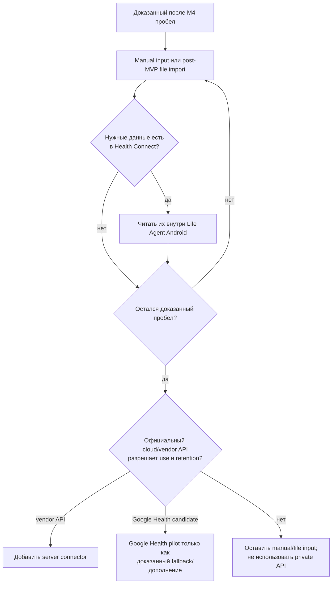

# Интеграции с устройствами и health-платформами

Актуальность: 27 июля 2026 года. Контекст этого документа — self-hosted система
для одного пользователя, а не публичный агрегатор и не медицинское устройство.

> Текущее hardware-решение уже принято: OnePlus Open/OxygenOS 16 и OnePlus
> Watch 2 сначала проверяются по цепочке
> `OHealth → Health Connect → Life Agent Android`. Конкретный day-0 spike и gate
> находятся в [delivery plan](11-mvp-delivery-plan.md). Production scope M4 —
> только сон и обычный `HeartRateRecord`; RHR добавляется лишь если Day 0
> подтвердит OHealth `RestingHeartRateRecord`. Все остальные wearable-типы и
> коннекторы в этом документе являются Day 0 discovery/post-MVP справочником, а
> не условной частью MVP.

## Android-приложение — интеграционный центр

MVP не использует Telegram ingress/transport или отдельный Life Agent companion.
Один APK объединяет Jetpack Compose UI, ручной structured input, Health Connect
reader, Room, encrypted outbox и WorkManager sync:

```text
ручные формы / presets ───────────────────────────┐
OnePlus Watch 2 → OHealth → Health Connect ──────┤
будущий file import через Android SAF ─ ─ ─ ─ ─ ┤
                                                 ▼
                   Life Agent Android → Room → encrypted outbox
                                      → HTTPS life.andriyshkoy.ru
                                      → PostgreSQL / backup / future RAG
```

Backend не получает Android permissions и не читает Health Connect напрямую.
Даже без сети ввод сначала фиксируется в Room, а WorkManager доставляет
idempotent operations после восстановления соединения.

## Post-MVP инвентаризация перед выбором API

До выбора коннектора нужно выписать фактическую цепочку данных:

| Что уточнить | Пример |
|---|---|
| Телефон и ОС | Pixel/Android 16, iPhone/iOS 27 |
| Наличие Google Play Services | важно для Health Connect и Google Health |
| Устройство и региональная версия | OPPO Watch X2, Galaxy Watch, Garmin |
| Приложение и версия | OHealth, Samsung Health, Garmin Connect |
| Где виден каждый показатель | только в vendor app, Health Connect, Apple Health |
| Что уже оплачено | WHOOP/Oura membership |
| Какие данные действительно нужны | сон, HRV, тренировки, вес, а не «всё» |
| Требуемая детализация | дневной итог, samples, маршрут, подходы |
| Нужна ли история | с сегодняшнего дня или backfill за несколько лет |

Нельзя выбирать часы по рекламному списку сенсоров. Важен весь путь:

```text
сенсор → часы → приложение производителя → Health Connect
       → Life Agent Android → encrypted Room/outbox → наш сервер

либо, только для доказанного пробела:
vendor cloud → разрешённый API → server connector
```

Наличие метрики в приложении производителя не означает, что она экспортируется.
Например, readiness, Body Battery, Energy Score, sleep score и подробные
тренировочные показатели часто не имеют универсального типа.

## Post-MVP дерево решения для доказанного пробела

Это дерево запускается только после M4 и отдельного решения о расширении scope:



## Место интеграций в канонических M0–M4

Этот документ не задаёт отдельный порядок реализации. Нормативные задачи и gates
находятся в [delivery plan](11-mvp-delivery-plan.md):

| Milestone | Роль интеграций и gate |
|---|---|
| M0 — Day 0 | Foreground probe проверяет сон, обычный `HeartRateRecord` и RHR; остальные типы видны только как discovery. RHR входит в M4 лишь при OHealth `RestingHeartRateRecord`, а прочие результаты не расширяют MVP. |
| M1 — local Notes | Android foundation, Room/outbox и полный локальный Notes slice; production Health Connect и server connector ещё не нужны. |
| M2 — server sync | Notes доказывают enrollment, идемпотентный HTTPS sync, PostgreSQL и baseline backup. Этот transport затем переиспользует M4. |
| M3 — manual domains | Питание, самочувствие и лекарства/БАДы используют уже проверенный M1/M2 контур без wearable-зависимости. |
| M4 — Health Connect | Основной APK импортирует только сон и обычный `HeartRateRecord`; RHR — лишь если M0 подтвердил OHealth `RestingHeartRateRecord`. Все прочие wearable-типы остаются post-MVP. |

Generic file import, Google Health, прямой vendor API и iOS/HealthKit возможны
только после MVP и отдельного решения о доказанном пробеле.

В post-MVP официальный CSV/JSON/XML/FIT/TCX/GPX-файл может быть нормальным
источником и для одного пользователя иногда проще OAuth-коннектора. Тогда файл
выбирается системным Android Storage Access Framework; оригинал сохраняется
только при явной необходимости и разрешённом retention, вместе с checksum,
версией parser и отчётом об импорте. Повтор того же файла не создаёт дубли.

## Базовый контракт любого коннектора

### Provenance

У каждой записи сохраняются:

- `source_vendor`, `source_app`, `source_device` и, если доступно, модель;
- `source_record_id` и тип исходной записи;
- минимальный набор исходных полей; raw payload/неизменяемая ссылка только если
  это разрешено договором, нужно для воспроизводимости и имеет явный retention;
  иначе сохраняются source ID/version, checksum при наличии и версия mapping;
- observed start/end, исходный timezone/offset;
- source-created, source-updated и ingested time;
- единица и исходная точность;
- способ записи: sensor, manual, derived, self-reported;
- connector и версия преобразования;
- текущий статус и факт удаления.

Vendor score не превращается в измерение. Например, Oura Readiness, Garmin Body
Battery и Samsung Energy Score — разные производные показатели и хранятся
раздельно.

### Дедупликация

Порядок идентификации:

1. `(source, source_record_id)`;
2. исходная provenance, если одна запись прошла через vendor, Health Connect и
   Google Health;
3. устойчивый fingerprint из типа, интервала, значения, устройства и метода;
4. ручная проверка, если совпадение вероятное, но не доказано.

Нельзя одновременно считать авторитетными прямой vendor stream и его копию из
агрегатора. Для каждого типа задаётся приоритет источников. Reconciled result и
raw vendor records можно хранить вместе, но в дневной итог входит только один
выбранный ряд.

### Sync и удаления

Обычный цикл:

```text
initial backfill
→ webhook/change token/anchor
→ idempotent upsert или tombstone
→ ежедневный overlapping reconciliation
→ периодическая проверка cursors и подписок
```

Webhook почти всегда означает «данные изменились», после чего выполняется pull.
Повторы и события не по порядку считаются нормой. Удаление источника должно
создавать tombstone и исключать запись из итогов; молча игнорировать delete
нельзя.

### OAuth и disconnect

- Только Authorization Code flow официального поставщика.
- Случайные `state` и PKCE, когда поддерживается.
- Минимальные read-only scopes.
- Refresh tokens шифруются отдельно от health data.
- Ротация токена сериализуется, чтобы параллельные workers его не потеряли.
- действие Disconnect в Android отзывает доступ и отключает подписки, но
  отдельно спрашивает о судьбе уже импортированной истории: сохранить её либо
  создать cascade-delete/tombstones для Room и PostgreSQL; физическое исчезновение
  из rolling backup следует документированному purge/retention окну.
- Логин/пароль пользователя, scraping и private mobile endpoints не
  используются.

## Google Health API: отложенный cloud fallback

В 2026 году [Google Health API](https://developers.google.com/health) стал
следующим поколением Fitbit Web API. Это OAuth 2.0 REST/gRPC API с webhooks,
rollups и reconciled stream из нескольких источников.

[Google Health app](https://support.google.com/googlehealth/answer/14236613)
может импортировать данные через Health Connect на Android, Apple Health на iOS
и некоторые прямые подключения. Официально перечислены Apple Watch, Garmin,
Samsung, WHOOP, Oura, Withings, Xiaomi/Amazfit, Strava, MyFitnessPal и другие
источники. Само приложение требует Android 11+ или iOS 16.4+:
[setup requirements](https://support.google.com/product-documentation/answer/14226283).

Потенциальный дополнительный путь для источника, которого нет в Health Connect:

```text
часы/vendor app
→ Health Connect или Apple Health
→ Google Health app и Google Account
→ Google Health API
→ self-hosted backend
```

Этот путь не заменяет Life Agent Android и не входит в M0–M4. Его можно
рассматривать только как post-MVP fallback. Если одни и те же записи доступны по
обоим маршрутам, только один stream назначается authoritative для конкретного
data type, иначе сон, шаги и калории будут учтены дважды.

`dataPoints:reconcile` по умолчанию использует `all-sources` и объединяет
перекрывающиеся записи. Поддерживаются activity, steps, exercise, HR/RHR/HRV,
сон, SpO₂, дыхание, температура, VO₂max, body metrics, питание и другие типы.
Фактическое покрытие зависит от устройства и приложения:
[data types](https://developers.google.com/health/data-types),
[reconcile](https://developers.google.com/health/reference/rest/v4/users.dataTypes.dataPoints/reconcile).

### Почему это пока пилот

Google не обещает, что каждый импортированный sample, исходный UUID и полная
provenance стороннего приложения попадут в API. Значения после дедупликации
могут отличаться от vendor app. Apple Health сейчас импортирует в Google Health
до трёх месяцев истории:
[Apple Health integration](https://support.google.com/googlehealth/answer/17037331).

На реальном аккаунте нужно проверить:

- steps, sleep stages, HR/HRV и workouts за 3–7 дней;
- детализацию и задержку;
- источник каждой записи;
- webhook после нового сна/тренировки;
- исправление и удаление;
- отсутствие двойного счёта.

### Auth, policy и цена

Webhooks подписаны, но содержат уведомление, а не health payload; после них нужен
pull. Необработанные notifications хранятся до семи дней, поэтому остаётся
nightly reconciliation:
[webhooks](https://developers.google.com/health/webhooks).

Для personal-use клиента действует исключение из обязательной restricted-scope
verification, если приложением пользуется владелец или несколько лично знакомых
людей. Останутся unverified warning и лимит до 100 пользователей. В OAuth
Testing refresh token обычно живёт семь дней, поэтому до dogfooding нужно
проверить перевод consent screen в Production:
[OAuth exceptions](https://developers.google.com/identity/protocols/oauth2/production-readiness/restricted-scope-verification#exceptions-to-verification_requirements).

Для публичного продукта потребуются OAuth review и обычно ежегодный CASA
assessment; официальный ориентир внешней оценки — $500–4,500. Для single-user
post-MVP pilot отдельная плата за API не опубликована:
[verification](https://developers.google.com/health/app-verification),
[limits](https://developers.google.com/health/rate-limits).

[Google Health data policy](https://developers.google.com/health/policies/health-api-developer-user-data-policy)
разрешает явные journaling, monitoring, analysis и sync-функции. Для будущего
внешнего AI нужны отдельное раскрытие и согласие пользователя. Данные и токены
шифруются; реклама, продажа данных и скрытое вторичное использование запрещены.
Google также требует сохранять данные с той же гранулярностью, с которой они
были получены, поэтому raw samples нельзя заменять только дневными итогами:
[Developer Terms](https://developers.google.com/health/policies/health-api-developer-terms-and-conditions).

API не публикует country allowlist. Россия отсутствует в
[consumer support-region selector](https://support.google.com/googlehealth/answer/15117925),
хотя Google Health присутствует в
[российском App Store](https://apps.apple.com/ru/app/google-health-fitbit/id462638897).
OAuth, импорт и webhook на конкретном Google Account являются go/no-go тестом,
а не гарантией.

## Health Connect внутри Life Agent Android

[Health Connect](https://developer.android.com/health-and-fitness/health-connect)
— локальное Android-хранилище, не server API. Его читает основной Life Agent APK
с разрешения пользователя:

```text
vendor app → Health Connect → Life Agent Android
           → Room → encrypted outbox → self-hosted API
```

Требования и ограничения:

- Android 9+ с Google Play Services;
- Android 14+ содержит системный модуль, на Android 13- нужен отдельный app;
- work profile не поддержан;
- отдельные runtime permissions по типам;
- background read и история старше обычных 30 дней требуют дополнительных
  permissions;
- server webhook нет.

Incremental sync использует `getChangesToken/getChanges`; неиспользованный token
истекает через 30 дней. Нужны capture при открытии, WorkManager, локальный outbox
и catch-up:
[read/history/background](https://developer.android.com/health-and-fitness/health-connect/read-data),
[sync](https://developer.android.com/health-and-fitness/health-connect/sync-data).

Для M4 использовать stable
[`health-connect-client 1.1.0`](https://developer.android.com/jetpack/androidx/releases/health-connect).
Основное приложение показывает permissions по типам, время последнего capture и
server sync, pending outbox, последние ошибки, export и delete. В M4
запрашиваются только read permissions сна и обычного `HeartRateRecord`; RHR
permission добавляется лишь если Day 0 подтвердил OHealth
`RestingHeartRateRecord`. Остальные типы остаются discovery и post-MVP
независимо от их наличия в probe.

### Local capture и server sync

Health Connect token относится к локальному source stream и не должен зависеть
от доступности сервера:

```text
read page
→ Room transaction:
     source versions + tombstones + encrypted outbox + next changes token
→ WorkManager HTTPS push
→ per-operation ACK
→ pull server changes by server_sequence cursor
```

Повтор одной операции использует тот же `operation_id`; один
`source_record_id/version` materialize только один source fact. Если приложение
долго не запускалось и token истёк, выполняется bounded lookback с
source-aware deduplication. Отзыв одного permission переводит только
соответствующий stream в `permission_missing`, не обнуляет метрику и не ломает
остальные типы.

Android background execution не является realtime SLA. WorkManager гарантирует
отложенный запуск при выполнении constraints, а при открытии приложения всегда
делается catch-up. Пользователь видит различие:

- `нет данных`;
- `нет разрешения`;
- `ещё не синхронизировано`;
- `последняя синхронизация завершилась ошибкой`.

Health Connect остаётся функцией основного Life Agent APK, а не отдельным
headless bridge. Это продуктовый и security-инвариант проекта. Если APK позже
публикуется через Google Play, для каждого реально используемого типа отдельно
выполняются Data Safety, Health Apps declaration, privacy policy и минимизация
permissions:
[Health Connect publishing](https://developer.android.com/health-and-fitness/health-connect/publish).

## iOS/HealthKit — справка на будущее, не MVP

У Apple нет публичного HealthKit REST API. Доступ идёт локально через
[`HKHealthStore`](https://developer.apple.com/documentation/healthkit/hkhealthstore)
из iOS/watchOS app:

```text
Apple Watch → HealthKit на iPhone
→ HKObserverQuery → HKAnchoredObjectQuery
→ encrypted outbox → self-hosted API
```

Observer сообщает об изменении, anchored query возвращает новые samples,
deletions и новый anchor:
[observer queries](https://developer.apple.com/documentation/healthkit/executing-observer-queries),
[anchored query](https://developer.apple.com/documentation/healthkit/hkanchoredobjectquery).

Background delivery не является realtime SLA. После force quit iOS не поднимет
app ради HealthKit; после foreground, unlock, reboot и сети нужен catch-up.
HealthKit также не позволяет отличить отказ в read permission от отсутствия
samples, поэтому пустой результат означает `unknown`, не ноль.

Нужны Mac и Xcode. Free Personal Team годится для короткого прототипа, но
подпись обычно истекает через семь дней; постоянный TestFlight/App Store требует
Apple Developer Program, обычно $99/год. Apple предупреждает, что enrollment
может быть ограничен санкциями:
[program enrollment](https://developer.apple.com/help/account/membership/program-enrollment),
[membership comparison](https://developer.apple.com/support/compare-memberships/).

Возвращаться к этой ветке стоит только при реальном переходе пользователя на
iPhone. Тогда сначала можно проверить Apple Health → Google Health API, но
HealthKit останется вариантом с наилучшим контролем детализации, provenance и
удалений.

## Vendor-интеграции

### Будущие кандидаты и ограничения

Кроме OHealth → Health Connect для текущего устройства, строки ниже описывают
post-MVP candidates. Наличие устройства или API не делает connector частью MVP.

| Источник | Базовый или исследовательский путь | Будущий direct candidate | Не делать |
|---|---|---|---|
| OHealth | M4: Health Connect для сна/`HeartRateRecord`; RHR только при OHealth `RestingHeartRateRecord` в M0 | Google Health только post-MVP при доказанном пробеле | private OHealth endpoints |
| Samsung | Post-MVP: проверить Health Connect mapping | Data SDK для proprietary metrics | старый deprecated SDK |
| Garmin | Post-MVP: Health Connect/Apple Health/file import | Health API при business approval | scraping Garmin Connect |
| Polar | Post-MVP pilot v3, если устройство уже есть | v4 granular data | не смешивать v3/v4 без проверки |
| Withings | Post-MVP Public API pilot для нужного устройства | Enterprise только при необходимости | частый произвольный polling |
| WHOOP | Post-MVP pilot при существующем membership | public approval/BLE | считать cloud API realtime HR |
| Oura | Post-MVP ограниченный file/aggregator pilot | только после письменного разрешения | direct API в долговременный RAG |
| Fitbit | Post-MVP Google Health pilot | дополнительные scopes после отдельного решения | legacy Fitbit Web API |
| Google Fit | — | — | новая интеграция |

### OHealth

Под `OHealth`, вероятнее всего, имеется в виду бывший HeyTap Health — vendor
companion для OPPO/OnePlus Watch, а не отдельный Life Agent app. Официальные
страницы OPPO/OnePlus подтверждают sync с Health Connect:
[OHealth](https://play.google.com/store/apps/details?id=com.heytap.health.international),
[OPPO Watch X2](https://www.oppo.com/es/accessories/watch-x2/).

Публичной документации cloud REST/OAuth/webhook API для health-данных OHealth не
найдено. Рабочий путь M4 — OHealth → Health Connect → Life Agent Android для сна
и обычного `HeartRateRecord`, плюс RHR только если M0 подтвердил OHealth
`RestingHeartRateRecord`. Google Health остаётся отдельным post-MVP fallback, а
не промежуточным обязательным звеном. Остальные типы можно проверить на
устройстве только как discovery; Chinese/non-GMS firmware может не поддержать
цепочку.

Если имелся в виду
[Open Health Stack](https://developers.google.com/open-health-stack/overview),
это FHIR-инструментарий для clinical/health-worker apps, а не wearable
aggregator.

### Samsung Health

Samsung Health передаёт основные steps, sleep, exercise, HR, SpO₂ и body data в
Health Connect:
[Samsung Health через Health Connect](https://developer.samsung.com/health/blog/en/accessing-samsung-health-data-through-health-connect).

Актуальный
[Samsung Health Data SDK](https://developer.samsung.com/health/data/overview.html)
работает с локальным хранилищем Samsung Health, а не с облаком. Он нужен позже
для Energy Score, sleep score/context, skin temperature, sleep apnea, IHRN и
других данных, отсутствующих в универсальном mapping. Developer Mode годится
для тестирования; публичный release требует Samsung partnership и регистрации
package/signature:
[verification](https://developer.samsung.com/health/data/guide/app-verification.html).
Цена и SLA partnership не опубликованы.

### Garmin

[Garmin Health API](https://developer.garmin.com/gc-developer-program/health-api/)
— cloud-to-cloud OAuth 2.0 API с Push или Ping/Pull. Он покрывает сон, HR,
stress, Pulse Ox, Body Battery, respiration, body composition и другие wellness
данные. Подробные тренировки/FIT относятся к отдельному
[Activity API](https://developer.garmin.com/gc-developer-program/activity-api/).

Connect Developer Program предназначен для business/enterprise use. Публичного
прайса нет: документация одновременно упоминает отсутствие общей program fee и
возможные license fee/minimum device order для коммерческих метрик. Для
single-user проекта approval нельзя считать гарантированным.

Для будущей оценки Garmin Connect умеет односторонне писать основные показатели
в Health Connect на Android 14+, но без Body Battery, stress и части богатых
данных:
[официальный mapping](https://support.garmin.com/en-GB/?faq=JToBEy0jfe6pIygark2Ui5).

При прямом API нужно хранить Garmin и модель устройства в provenance. Garmin
требует атрибуцию и для производных AI/ML-результатов:
[Brand Guidelines](https://developer.garmin.com/downloads/brand/Garmin-Developer-API-Brand-Guidelines.pdf).

### Polar

[Polar AccessLink v3](https://www.polar.com/accesslink-api/) — практичный
server-side OAuth 2.0 API для exercises, activity, continuous HR, sleep, Nightly
Recharge, SleepWise и Cardio Load. Есть HMAC-signed webhooks для основных
событий; после webhook выполняется pull.

[Dynamic API v4](https://www.polar.com/polar-api-v4/) добавляет granular scopes
и более детальные samples, tests, temperature и device data. В v4 webhook
механизм публично не описан, а план сосуществования v3/v4 не вполне ясен.
Поэтому для будущего post-MVP pilot разумен v3 + nightly reconciliation; v4
добавлять после проверки конкретных нужных типов.

API сейчас бесплатен, отдельного country allowlist нет. Создание клиента, OAuth
и webhook нужно проверить с фактическим Polar Flow account.

### Withings

[Withings Public API](https://developer.withings.com/developer-guide/v3/withings-solutions/app-to-app-solution/)
доступен физлицам без отдельного договора. Это server-side OAuth 2.0 API с
историей и notifications для activity, sleep, веса/body composition, BP, pulse
и других поддерживаемых устройством измерений.

Бесплатный план даёт Basic Biomarkers, до 1,000 active users и 120 requests/min
на приложение. Enterprise и advanced/raw biomarkers имеют custom pricing:
[API plans](https://developer.withings.com/developer-guide/v3/withings-solutions/withings-api-plans/).

Notification является сигналом для fetch; пропуски восстанавливаются по
`lastupdate`. Россия отсутствует в текущем официальном списке прямой доставки,
но отдельного API country allowlist нет:
[shipping](https://support.withings.com/hc/en-us/articles/115012357987-Webstore-Which-countries-do-you-ship-to-How-long-do-orders-take-to-arrive).

Это возможный post-MVP direct connector, если уже используются весы, тонометр
или sleep-устройство Withings и M4 доказал соответствующий пробел.

### WHOOP

[WHOOP API v2](https://developer.whoop.com/api/) предоставляет cycle/strain,
recovery, RHR/HRV, SpO₂, temperature, sleep и workouts. Это OAuth 2.0 API;
подписанные webhooks есть для sleep, recovery и workout. Continuous/raw HR через
cloud API не выдаётся.

Новое приложение ограничено десятью WHOOP members до review. API бесплатен, но
разработчику нужны устройство и membership; sandbox без устройства нет:
[approval](https://developer.whoop.com/docs/developing/app-approval/),
[support](https://developer.whoop.com/docs/developing/support/).

Россия отсутствует в официальном
[shipping list](https://support.whoop.com/s/article/Where-does-WHOOP-ship-to).
Кроме того,
[API Terms](https://developer.whoop.com/api-terms-of-use/) ограничивают
постоянные копии/cache WHOOP Data без подходящего разрешения. Для single-user,
где владелец приложения и данных совпадает, формулировка остаётся неоднозначной.
До многолетней БД и RAG нужно получить письменное подтверждение retention.

### Oura

Технически [Oura API v2](https://cloud.ouraring.com/v2/docs) богат: сон,
readiness/activity, HR/HRV/temperature, SpO₂, stress, resilience и workouts.
Россия, однако, отсутствует в
[supported countries](https://support.ouraring.com/hc/en-us/articles/41056787356307-Supported-Countries);
membership и платежи из неподдерживаемой страны официально не гарантированы.

Главный блокер —
[Oura API and MCP Agreement от 8 июня 2026](https://cloud.ouraring.com/legal/api-agreement):

- API data можно хранить только строго необходимое время;
- aggregator не может хранить/cache Oura data;
- данные из Oura API нельзя передавать LLM как prompt, input, evaluation или
  training data;
- для non-aggregator допустимый LLM-путь ограничен официальным Oura MCP;
- embeddings и другие persistent AI representations запрещены без отдельного
  разрешения.

Прямой Oura API поэтому не подходит для долговременного life-log и будущего RAG
без письменного соглашения. Подмножество Oura может попасть через Health
Connect/Apple Health в Google Health, но этот путь нельзя считать юридическим
обходом условий Oura.

### Fitbit и Google Fit

Новый Fitbit connector следует строить на Google Health API. Официальный
migration guide уже называет Fitbit Web API legacy, требует нового Google OAuth
consent и рекомендует новым пользователям Google Health API; точный cutoff в
этом документе не зафиксирован:
[migration](https://developers.google.com/health/migration).

Google Fit — другой legacy API. По актуальному migration guide Android и REST
API поддерживаются только до конца 2026 года. Для нового проекта использовать
Health Connect и Google Health API:
[Fit migration guide](https://developer.android.com/health-and-fitness/health-connect/migration/fit).

## Региональные и договорные go/no-go проверки

| Источник | Что проверить до разработки |
|---|---|
| Google Health | установка, OAuth и импорт на конкретном российском аккаунте |
| Health Connect | GMS, Android/firmware, реальные exported types |
| Apple | Developer Program enrollment/payment и регион метрик |
| Samsung | partnership только если нужен direct SDK |
| Garmin | business approval, цена, регион и attribution |
| Polar | client creation, OAuth и webhook на аккаунте пользователя |
| Withings | существующий аккаунт/устройство; доставка в РФ не поддержана |
| WHOOP | membership, регион и письменная retention policy |
| Oura | поддерживаемый аккаунт и отдельное разрешение на storage/AI |

ECG, irregular rhythm, sleep apnea, blood pressure и другие регулируемые функции
могут зависеть от страны, версии устройства и firmware, даже если API содержит
соответствующий тип.

## Gate для будущего connector

Будущий file, Google Health или direct vendor connector рассматривается только
после M4, когда конкретный нужный metric или backfill доказанно отсутствует в
OHealth → Health Connect, и после отдельного решения о scope, policy и retention.
Nutrition seed CSV личного каталога остаётся ограниченным M3-инструментом и не
является универсальным health-file parser.

Перед реализацией фиксируются:

- точный отсутствующий use case и authoritative source для каждого типа;
- разрешённые OAuth scopes, storage/retention, deletion и AI-use policy;
- региональная доступность, approval, цена и эксплуатационный SLA;
- provenance, mapping version и защита от двойного счёта.

Connector принимается только после тестов initial backfill, duplicate delivery,
out-of-order update, token refresh, revoke, deletion, timezone boundary и
восстановления после downtime. Эти post-MVP gates не меняют M0–M4 задним числом.
