# Безопасность и приватность

> Этот документ — инженерный ориентир для личного self-hosted Android-приложения
> одного пользователя в России, а не юридическое заключение. При появлении
> других пользователей, коммерческого доступа, врача, тренера или работодателя
> необходимо заново спроектировать security/compliance-контур.

## Граница продукта

Life Agent — Android-first и local-first продукт:

- основной интерфейс, ручной ввод и Health Connect работают на телефоне;
- запись сначала надёжно сохраняется локально в Room;
- после M2 синхронизация с личным сервером будет идти фоново через outbox;
- после canonical ACK сервер будет хранить synced-копию и резервные копии;
- публичной регистрации, Telegram ingress и сторонней продуктовой аналитики нет;
- приложение и сервер обслуживают данные только одного владельца.

Telegram не входит в архитектуру MVP и не является доверенной или обязательной
частью системы. В будущем его можно добавить только как отдельный
нечувствительный канал уведомлений, не передавая туда health content.

```mermaid
flowchart LR
    WATCH[OnePlus Watch 2]
    OHEALTH[OHealth]
    HC[Health Connect на телефоне]
    APP[Life Agent Android]
    ROOM[(Encrypted Room + outbox)]
    API[life.andriyshkoy.ru<br/>TLS bootstrap live<br/>sync API target M2]
    DB[(PostgreSQL)]
    BACKUP[(Encrypted off-host backup)]

    WATCH --> OHEALTH
    OHEALTH --> HC
    HC -->|минимальные read permissions| APP
    APP -->|локальная транзакция| ROOM
    ROOM -->|HTTPS + short access token| API
    API --> DB
    DB --> BACKUP
```



Телефон и сервер принадлежат одному человеку, но сеть, APK-канал доставки,
CI/CD, сторонние приложения и потерянное устройство считаются недоверенными.
Health Connect остаётся локальным системным источником; сервер не может и не
должен обращаться к нему напрямую.

На 27 июля 2026 года отдельный сертификат для `life.andriyshkoy.ru` валиден и
content-free TLS bootstrap уже отвечает на `/healthz`. Это не означает запуск
production sync: routes `/api/v1/` остаются `404` до M2.

## Что защищаем

Критичные активы:

- питание, тренировки, сон, пульс, лекарства, симптомы и субъективные оценки;
- заметки, планы и будущие транскрипты или фотографии;
- локальная Room-база, незагруженный outbox и временные файлы приложения;
- access/refresh credential chain, ключи Android Keystore, DB credentials и
  ключи backup;
- Health Connect permissions и provenance импортированных записей;
- каноническая PostgreSQL-база, exports и резервные копии;
- будущие embeddings, summaries и AI-инференсы: они также могут раскрывать
  сведения о здоровье;
- целостность данных, включая единицу измерения, timezone, источник, ревизии и
  удаления.

Для single-user MVP принимаются следующие ограничения:

- есть один auth-principal `subject_id`, который server-side один-к-одному
  отображается в канонический `person_id`; клиент не выбирает ни один из них;
- первый production-релиз поддерживает одно активное Android-устройство;
- нет публичной регистрации, приглашений, ролей администратора или поддержки;
- нет рекламы, Crashlytics, сторонней аналитики и рекламного ID;
- внешняя обработка текста или health data выключена по умолчанию;
- CI получает исходный код и build secrets, но никогда не получает production
  health data, DB dump или production access/refresh tokens.

## Основные инварианты

1. Событие не теряется при отсутствии сети: UI подтверждает сохранение только
   после локальной Room-транзакции.
2. Повторная отправка не создаёт дубль: `operation_id + content hash` имеет
   durable receipt, а `event_id/revision_id` — client-generated UUID и серверные
   unique constraints.
3. APK не содержит серверный пароль, общий API key или enrollment credential.
4. Для каждого устройства существует отдельная отзываемая credential chain:
   short-lived access token и rotating refresh token.
5. Оба opaque access/refresh token хранятся server-side только как hashes внутри
   отзываемой session family с expiry, rotation, reuse и revocation state.
6. Health Connect permissions только read-only и только для реально
   реализованных типов данных.
7. Health content, токены и тела запросов не попадают в логи.
8. Android backup/transfer не копирует Room, outbox, ключи и credentials.
9. PostgreSQL и backup недоступны напрямую из публичного интернета.
10. Любой путь удаления включает локальную копию, сервер, очередь и дальнейшее
    восстановление из backup через durable purge ledger/watermark.

## Модель угроз

| Угроза | Возможное последствие | Основная защита |
|---|---|---|
| Потерянный разблокированный телефон | Чтение дневника, ложные записи, экспорт | Системная блокировка, app lock опционально, Keystore, server-side revoke |
| Чтение файлов приложения или adb backup | Раскрытие Room/outbox/token | Private storage, шифрование, backup exclusion, запрет debug в release |
| Утечка enrollment-кода | Регистрация чужого устройства | Одноразовый короткий TTL, atomic consume, временно открытый endpoint |
| Утечка access/refresh token | Чтение/запись от имени приложения | Short-lived access, rotating refresh, Keystore, token hashes и точечный revoke |
| Повтор сетевого запроса | Дубли питания, лекарства или тренировки | `Idempotency-Key = batch_id`, durable batch body/membership, `operation_id + content hash`, transactional receipt |
| MITM или ошибочный cleartext endpoint | Раскрытие health payload/token | Только TLS к `life.andriyshkoy.ru`, Network Security Config, без HTTP fallback |
| Взлом API/БД | Раскрытие всего дневника | Hardening, least privilege, encryption at rest, ключи отдельно от данных |
| Утечка через Logcat/nginx/APM | Скрытая копия content или credential | Content-free logs, redaction, короткий retention, без third-party APM |
| Компрометация CI или APK | Backdoor либо кража signing key | Protected environment, pinned dependencies, release signing и provenance |
| Повреждение или потеря телефона | Потеря ещё не синхронизированного outbox | Durable encrypted outbox, понятный sync status, серверная canonical copy |
| Повреждение или потеря сервера | Потеря многолетнего дневника | Зашифрованные off-host backups и регулярный restore drill |
| Ошибка единиц, времени или origin | Неверные будущие выводы | UTC + исходный offset, provenance, validation, revisions |
| Неполное удаление | Данные возвращаются из cache/backup | Retracted current revision, каскадный purge, durable ledger/watermark и ограниченный backup retention |

## Enrollment Android-устройства

Публичного signup endpoint нет. Начальная привязка выполняется из локальной
административной команды на сервере:

1. Владелец создаёт одноразовый enrollment-код с TTL не более 10 минут.
2. Приложение по TLS отправляет код и метаданные установки без health content.
3. Сервер атомарно погашает код, связывает локальную installation с
   `device_id/person_id` и выдаёт короткоживущий opaque access token и случайный
   rotating refresh token минимум 256 бит энтропии.
4. Приложение немедленно сохраняет refresh token в зашифрованном виде; wrapping
   key создаётся в Android Keystore и не экспортируется. Access token остаётся в
   памяти либо, если нужен process restart, также хранится только
   Keystore-wrapped и удаляется не позже expiry.
5. Сервер сохраняет hashes обоих access/refresh tokens, `session_family_id`,
   generation/expiry, rotation/reuse/revocation state, `device_id` и audit
   timestamps. Исходные tokens не пишутся в БД, backup или лог.
6. После успешной привязки enrollment endpoint снова закрывается либо принимает
   только новый явным образом выпущенный одноразовый код.
7. Если уже существует активное устройство, enrollment по умолчанию
   отклоняется. Замена разрешена только отдельной явной server-side операцией,
   которая атомарно отзывает старую credential chain и активирует новую.

Access token передаётся только в `Authorization` header по HTTPS. Refresh token
передаётся только dedicated refresh endpoint и никогда не используется как
обычный API bearer. Credentials не передаются в URL, query string, crash report
или diagnostic export. Opaque tokens генерируются криптографически стойким
генератором; поэтому для server-side проверки допустим фиксированный
криптографический hash с constant-time comparison. Можно дополнительно
использовать server-side HMAC/pepper, хранимый отдельно от PostgreSQL.

`device_session` представляет отзываемую family, а отдельные token rows — opaque
access или refresh hash, generation, expiry, `spent_at`, successor и revoke
state. Успешный refresh одной транзакцией помечает предъявленный refresh hash
spent, создаёт новые access/refresh hashes в той же family и возвращает plaintext
только клиенту. Повтор spent refresh фиксируется как reuse и отзывает всю family;
каждый access-token request проверяет token expiry и family revocation. Spent
refresh hashes сохраняются как минимум до конца окна их возможного reuse/family
expiry; иначе replay невозможно обнаружить.

Ограничения MVP:

- credential chain относится к одному устройству и фиксированному server-side
  mapping `subject_id → person_id`;
- endpoint отклоняет неизвестные device ID, revoked token и попытку записать
  данные другого субъекта;
- auth/enrollment имеют rate limit и нейтральные сообщения об ошибке;
- refresh выполняется single-flight; повторное использование уже rotated/spent
  refresh token отзывает всю session family и все её access/refresh tokens;
- reinstall считается новым устройством: выпускается новая chain, старая явно
  отзывается;
- потеря телефона обрабатывается server-side revoke без смены DB password или
  credentials других компонентов;
- APK signing certificate не используется как единственный способ API-auth.

В более поздней версии access token можно дополнить подписью каждого запроса
неэкспортируемым EC-ключом Android Keystore и защитой от replay. Это не блокирует
MVP при наличии TLS, idempotency и индивидуального отзываемого token.

## Локальное хранение Android

### Room и outbox

До enrollment приложение создаёт и хранит в зашифрованной app-private БД opaque
`installation_id` и `local_owner_id`. Они не являются server principal и не
передаются как право выбрать владельца, но позволяют сохранять полную локальную
историю без сети. Выданные позже `server_device_id/server_person_id` — nullable
enrichment; enrollment заполняет binding, не меняя ранее созданные
`capture_id/event_id/revision_id/operation_id`.

Все пользовательские действия выполняются local-first:

1. ViewModel формирует canonical candidate и отдельные client-generated
   `capture_id`, `event_id`, `revision_id`, `operation_id`.
2. Одна Room-транзакция записывает capture, событие/revision и строку outbox под
   `installation_id/local_owner_id`.
3. UI показывает состояние `saved locally`.
4. После enrollment WorkManager до отправки durable сохраняет `batch_id`, exact
   canonical body bytes/hash и ordered membership
   `operation_id + operation content hash`.
5. Request отправляет `Idempotency-Key`, в точности равный `batch_id`; retry
   повторяет сохранённые bytes, а не сериализует batch заново.
6. Сервер одной транзакцией коммитит canonical revision с `capture_id`,
   `operation_id + content hash`, receipt и server sequence.
7. Только после commit этой canonical transaction сервер возвращает
   per-operation ACK. Canonical-committed conflict тоже получает terminal ACK и
   не считается rejected; invalid operation receipt/ACK не получает.
8. После ACK outbox row может быть удалена по короткому техническому TTL.

`capture_id` проходит без замены через local capture/revision/outbox, transport,
raw ingest, operation receipt и canonical provenance; retry сохраняет его.

Нельзя сначала отправлять данные в сеть и лишь затем сохранять их локально.
WorkManager может выполнить одну задачу повторно, поэтому exactly-once
обеспечивается не scheduler, а per-operation identity/receipt сервера. После
частичного ACK новый batch включает только непринятые `operation_id`; прежний
batch ID с другим body hash или membership является protocol/security error.

Outbox содержит минимальный payload. Он не должен бесконечно расти: приложение
показывает возраст/число pending events и заметную ошибку после нескольких дней
без успешной синхронизации. Удаление outbox row по TTL удаляет только delivery
copy: локальные captures/events и все revisions со статусами `active|retracted`
сохраняются весь текущий MVP. Offline delete создаёт новую immutable revision с
`record_status = retracted` (tombstone), передвигает локальный current pointer на
неё и до ACK не исчезает из outbox.

### Шифрование данных приложения

Минимальная защита production-сборки:

- данные лежат только в app-private internal storage;
- Room и outbox шифруются случайным database/data encryption key;
- DEK хранится только в wrapped-виде; wrapping key создаётся через
  [Android Keystore](https://developer.android.com/privacy-and-security/keystore);
- используется поддерживаемая реализация encrypted SQLite либо
  application-level AEAD; собственный шифр разрабатывать нельзя;
- для AEAD используются AES-GCM или ChaCha20-Poly1305 с уникальным nonce и
  версией ключа;
- temporary/export files создаются в private storage, имеют TTL и удаляются
  после использования;
- release manifest не допускает debuggable build, cleartext traffic или
  широкого file sharing.

Android file-based encryption является полезным базовым слоем, но не заменяет
защиту Room и credential. Keystore защищает ключевой материал от экспорта, но
скомпрометированный разблокированный процесс всё ещё может использовать ключ:
это учитывается в threat model.

### Backup и перенос на новый телефон

Health data, Room, outbox, token и key material исключаются из Android Auto
Backup и device-to-device transfer через manifest и `data-extraction-rules`.
Для production по умолчанию используется полный opt-out приложения из
[Auto Backup](https://developer.android.com/identity/data/autobackup), пока не
будет спроектирован отдельный зашифрованный формат экспорта.

Причины:

- Keystore key может не восстановиться вместе с ciphertext;
- восстановленный refresh credential создаст неожиданную копию устройства;
- Google/cloud backup станет дополнительным местом хранения health data;
- stale outbox после restore может повторно отправить старые операции.

Сервер и его проверенный backup являются способом восстановления. На новом
телефоне выполняется новый enrollment и синхронизация разрешённого server
snapshot:

1. новый device проходит обычную аутентификацию;
2. versioned bootstrap endpoint отдаёт events и revisions со статусами
   `active|retracted` постранично с непрозрачным cursor;
3. каждая страница применяется одной Room-транзакцией;
4. schema version проверяется до записи, а повтор страницы остаётся
   идемпотентным;
5. старый pending outbox никогда не восстанавливается из server snapshot;
6. после последней страницы приложение сохраняет bootstrap cursor и переходит
   к обычному incremental pull/push.

Несинхронизированные локальные данные могут быть потеряны при физической гибели
телефона — приложение обязано явно показывать этот риск. Bootstrap и
восстановление на новый телефон входят в end-to-end restore test.

### Блокировка приложения

Надёжный PIN/password экрана устройства обязателен. Biometric/app lock —
опциональная настройка интерфейса:

- закрывает sensitive screens и export после ухода приложения в background;
- использует системный `BiometricPrompt`, а не самодельное хранение PIN;
- не выдаёт себя за отдельную полноценную security boundary;
- учитывает, что authentication-bound key может блокировать фоновую
  синхронизацию.

Для MVP допускается background sync без биометрического prompt, если token и DEK
защищены Keystore, а устройство имеет secure lock screen. Пользователь может
выбрать более строгий режим с синхронизацией только после разблокировки
приложения.

## Permissions и Health Connect

- Запрашивать только `READ_*` permissions для типов, которые приложение уже
  умеет импортировать и объясняет в rationale.
- Core permission group после Day 0: подтверждённые сон и обычный пульс.
  Resting heart rate запрашивается только если найден как отдельный доступный
  record type; HRV, SpO₂, respiratory rate, тренировки, шаги, distance,
  calories, cadence/speed — отдельный incremental opt-in.
- Не запрашивать Health Connect write, background/history или exercise route до
  появления конкретной функции и отдельного threat review.
- Отказ или отзыв permission не является ошибкой аккаунта: ручной дневник
  продолжает работать, а UI показывает конкретно недоступный источник.
- Не запрашивать контакты, телефон, SMS, location, broad storage или accessibility
  permission для функций MVP.
- Разрешение `INTERNET` в production-приложении используется только для
  собственного API; Day 0 probe по-прежнему остаётся offline/read-only.
- Не предполагать, что OHealth экспортирует показатель только потому, что часы
  отображают его. Сохранять origin, время чтения и версию схемы.

Health Connect и его требования:

- [Android Health Connect](https://developer.android.com/health-and-fitness/health-connect);
- [Google Play Health Connect policy](https://support.google.com/googleplay/android-developer/answer/16558241?hl=en).

Хотя APK первоначально распространяется лично, минимизация permissions и
понятный rationale обязательны уже в sideload-сборке.

## API и транспорт

Целевой production sync API M2 будет доступен только по:

```text
https://life.andriyshkoy.ru/api/v1/
```

Текущее состояние bootstrap на 27 июля 2026 года:

- DNS и отдельный валидный TLS certificate уже работают;
- `GET https://life.andriyshkoy.ru/healthz` возвращает ровно
  `{"status":"ok","service":"life-agent","phase":"bootstrap"}`;
- `/api/v1/` пока возвращает `404`: production API остаётся target до M2, а
  наличие TLS bootstrap не разрешает загрузку health content.

Требования для M2:

- DNS указывает на личный сервер; сертификат выдан именно для
  `life.andriyshkoy.ru` и автоматически обновляется;
- HTTP перенаправляется на HTTPS, но приложение никогда не отправляет credential
  сначала по HTTP;
- Android Network Security Config запрещает cleartext traffic;
- hostname/certificate validation не отключается даже в debug;
- certificate pinning не является требованием MVP: ошибочный pin способен
  остановить синхронизацию при штатной ротации сертификата;
- nginx ограничивает body size, timeout и rate, но не логирует body,
  `Authorization` или query с content;
- аутентифицированный sync/event endpoint принимает только объявленную schema
  version, валидирует размер, единицы и timestamps;
- request имеет `device_id`, `capture_id`, `operation_id`, schema version и
  content hash; HTTP `Idempotency-Key` в точности равен `batch_id`;
- сервер отвечает per-operation ACK только после atomic canonical commit
  revision (`active|retracted`) и receipt для
  `operation_id + content hash` вместе с `server_sequence` и допустимым
  изменением authoritative `life_event.current_revision_id`;
- сохранение raw metadata, delivery attempt или background job без canonical
  commit ACK не даёт;
- client retry не меняет payload уже созданной revision.

Экспорт не выдаётся по постоянной публичной ссылке. Предпочтителен локальный
зашифрованный файл или короткоживущий одноразовый URL, созданный после
повторного подтверждения в приложении.

## Секреты и ключи

Обязательные правила:

- не коммитить secrets в Git, Docker image, Compose, APK assets, backup или
  пример конфигурации;
- не передавать secrets в command line, URL, exception, метрики и логи;
- production DB/API/backup secrets создавать на сервере, а не в CI;
- использовать Docker secrets, systemd credentials или отдельные
  root-readable файлы с минимальными правами;
- access/refresh token хранить на Android только в Keystore-wrapped виде, а
  opaque credentials на сервере — только как hashes с session-family
  expiry/rotation/reuse/revocation state;
- хранить release signing key отдельно от server credentials и иметь
  зашифрованную офлайн-копию;
- разделять debug/prod package, signing key, API base URL и базы;
- recovery/export/enrollment codes делать одноразовыми, короткоживущими и
  хранить server-side только в hash-виде;
- иметь короткий runbook ротации DB password, deploy key, signing access,
  backup key и access/refresh credential chain.

Нельзя шифровать PostgreSQL ключом, лежащим в той же БД, volume или резервной
копии. Потеря единственной Keystore-зависимой копии ключа не должна уничтожать
канонические серверные данные.

## Логи и наблюдаемость

В Android Logcat, nginx, application logs, PostgreSQL audit, CI output, APM и
error tracker запрещено записывать:

- заметки, названия еды, комментарии, симптомы и transcript;
- значения пульса, сна, SpO₂ и raw Health Connect records;
- Room/outbox payload, HTTP body и SQL bind parameters;
- `Authorization`, access/refresh token, enrollment code, DB/backup/deploy
  secret;
- export content, encryption key, nonce вместе с plaintext;
- полный connector response или exception с сериализованным request.

Достаточно content-free событий:

```text
event=sync_completed device=<pseudonym> records_created=3 duration_ms=...
event=sync_retry queue_depth=2 reason=timeout
event=auth_rejected reason=revoked_device
event=backup_verified backup_id=... checked_at=...
```

В production не подключаются Crashlytics и session replay. Если позже нужен
внешний error tracker, он проходит отдельный review, получает только
санитизированные stack traces и не записывает breadcrumbs с пользовательским
вводом.

Для Docker, journald и nginx настраиваются rotation, retention и верхний предел
размера. Debug logging ограничивается временем и не отключает redaction.

## Retention и минимизация

Рекомендуемые настройки personal MVP:

| Тип данных | По умолчанию | Дополнительное правило |
|---|---:|---|
| Локальные canonical events/revisions (`active|retracted`) | Весь текущий MVP | Зашифрованы; current задаёт pointer, история не очищается после ACK |
| Android outbox row/payload | До ACK, затем короткий технический TTL | TTL удаляет только delivery row; полная локальная history остаётся |
| Health Connect raw read result | Не сохранять целиком | Сразу нормализовать только необходимые поля |
| Нормализованные события на сервере | Пока нужны владельцу | С revision/provenance и возможностью удалить |
| Raw HTTP request dump | Не сохранять | Ошибка парсинга не меняет правило |
| Локальный voice/photo spool в будущем | До обработки, максимум 24 часа | Только explicit opt-in для длительного хранения |
| Prompt/response внешнего AI | Не сохранять | Внешний AI выключен по умолчанию |
| Security-аудит без content | 30–90 дней | Только псевдоним устройства |
| Зашифрованные server backups | Rolling 30 дней | Manifest связан с purge generation; ledger replay обязателен при restore |
| Export-файл | До явного получения, максимум 24 часа | Зашифрован, вне обычного backup |

Будущие OCR/voice функции сначала обрабатываются на устройстве или личном
сервере. EXIF удаляется до обработки фотографии. Передача во внешний ASR/LLM —
отдельный opt-in с указанием провайдера, страны, retention и конкретного объёма
данных.

## PostgreSQL и hardening сервера

Минимальный baseline:

- поддерживаемая ОС и своевременные security updates;
- отдельный непривилегированный service account;
- SSH password и root login запрещены; используются ключи, доступ желательно
  ограничить VPN/allowlist;
- firewall публикует только SSH по принятой политике и HTTP/HTTPS; PostgreSQL,
  queue и internal API доступны только Docker network/localhost;
- PostgreSQL role приложения не является superuser и имеет только права своей
  схемы;
- migrations выполняются отдельным контролируемым шагом, а не произвольным
  application account;
- контейнеры без `--privileged`, host PID/network, Docker socket и лишних Linux
  capabilities;
- volumes БД и backup зашифрованы; ключи находятся в другом security-контуре;
- зависимости и образы закреплены версиями, проверяются и регулярно обновляются;
- после M2 readiness/healthcheck проверяет API, БД, свободное место, сертификат и
  свежесть backup, не выводя content; текущий bootstrap `/healthz` остаётся
  content-free и не утверждает готовность API/БД;
- системные часы синхронизированы; события хранят UTC и исходный timezone/offset;
- dev/test не получают копию production health data;
- административные endpoint и PostgreSQL не публикуются на
  `life.andriyshkoy.ru`.

API обязан выводить единственного владельца из проверенной credential chain и
server-side mapping `subject_id → person_id`. Client-supplied identity field в
write request запрещён; его наличие отклоняется schema validation. Отсутствие
публичного UI не заменяет authorization.

## Резервные копии и восстановление

Backup считается рабочим только после успешного восстановления в чистое
окружение.

Для personal MVP:

- ежедневный зашифрованный backup PostgreSQL;
- минимум одна зашифрованная копия вне основного host;
- ключ backup хранится отдельно и доступен при потере сервера;
- retention, например 7 daily + 4 weekly либо rolling 30 дней;
- checksum и автоматическая проверка завершения;
- ежемесячное восстановление в изолированное окружение;
- документированные RPO/RTO, например не более суток потери и сутки на restore;
- каждый backup manifest связывает `backup_id/DB snapshot` с
  `purge_generation` на момент snapshot и защищается checksum;
- encrypted durable `purge_ledger` хранится дольше максимального backup retention
  и выдаёт монотонные generations; его encrypted hash-chained off-host replica
  не откатывается вместе с восстанавливаемой PostgreSQL, а per-target
  `purge_watermark` фиксирует применение к
  primary/projection/blob/export/restore targets;
- restore сверяет manifest binding и применяет все purge generations новее
  snapshot до актуального watermark до открытия восстановленной системы;
- после компрометации credentials меняются до возврата API в сеть.

Backup не содержит Android outbox, временный media spool, content logs,
незашифрованные secrets, APK signing key и старые export archives.

Restore drill проверяет:

1. запуск PostgreSQL и миграции;
2. расшифровку случайной выборки событий;
3. revisions, provenance и idempotency constraints;
4. manifest-to-snapshot purge generation, replay ledger до watermark и отсутствие
   ранее удалённых данных;
5. повторный export;
6. возможность отозвать старое устройство и выполнить новый enrollment.
7. paginated bootstrap на чистое устройство с revisions `active|retracted`,
   current pointers и совместимой schema version.

## Экспорт, удаление и отзыв

Экспорт включает нормализованные и производные события, время, timezone,
единицы, provenance, revisions, retention settings и версии parser/schema. Он
никогда не включает access/refresh token, DB secret или encryption key.

Операции интерфейса:

- удалить одно логическое событие через новую revision с
  `record_status = retracted` (tombstone), на которую указывает current pointer;
- удалить период;
- удалить исходный media, сохранив структурированное событие;
- отключить Health Connect тип данных;
- отозвать это Android-устройство;
- удалить все данные.

Большое удаление и полный export требуют повторного подтверждения и понятного
описания масштаба. Biometric prompt может быть дополнительным подтверждением,
но server-side authorization остаётся обязательной.

Каскад удаления охватывает Room/cache, outbox, canonical DB, revisions,
dead-letter queue, object storage, exports, будущие embeddings/vector index и
pending jobs. Операция получает durable `purge_generation`, scope в encrypted
purge ledger и watermarks применения; это отдельный anti-resurrection механизм,
а не canonical tombstone revision. Старые зашифрованные backups окончательно
исчезают не позже опубликованного retention, а до этого ledger replay исключает
возврат удалённого при restore.

Отзыв устройства:

1. пометить `device_id` и credential chain revoked на сервере;
2. пометить session family revoked и удалить token hashes либо оставить только
   неаутентифицирующий audit fingerprint;
3. отклонять все следующие запросы этого устройства;
4. на доступном телефоне уничтожить wrapped token, локальный DEK и private data;
5. для reinstall выполнить новый enrollment, не переиспользуя credential.

## CI/CD и supply chain

- Pull request/branch protection запускает compile, unit tests, lint и dependency
  checks.
- Workflow permissions минимальны; production deploy находится в отдельном
  protected GitHub Environment.
- Release keystore передаётся job только на шаг подписи, не печатается и не
  сохраняется как artifact. Его зашифрованная офлайн-копия обязательна.
- APK/AAB artifact публикуется с SHA-256, versionCode/versionName и commit SHA.
- Debug и release имеют разные application ID/signing identity/API config.
- Backend image публикуется по immutable digest; сервер deploy-ит именно digest.
- В image и GitHub artifact отсутствуют `.env`, DB dump, enrollment code,
  backup key и production access/refresh tokens.
- Deploy key ограничен конкретным сервером/репозиторием; SSH host key закреплён,
  а не принимается через `StrictHostKeyChecking=no`.
- Dependency update не выкатывается без повторных lint/test и review Health
  Connect permissions.

## Incident checklist

Признаки инцидента: потерянный телефон, неизвестный enrollment, утечка
access/refresh или deploy credential, неожиданная активность API, чтение БД
посторонним процессом,
публичный PostgreSQL/object bucket, health content в логах либо неподписанный
APK.

### 1. Сдержать

- отозвать access/refresh credential chain и закрыть enrollment;
- остановить API или ограничить его firewall, если источник неизвестен;
- отозвать deploy/registry/DB credentials;
- изолировать подозрительный host;
- не удалять сразу технические свидетельства;
- прекратить внешние processors и фоновые exports.

### 2. Определить масштаб

- зафиксировать время обнаружения и предполагаемое начало;
- проверить, какие устройства, secrets, таблицы, objects и backups доступны;
- проверить content-free audit/auth logs;
- выявить ложные/изменённые events и нарушенные revision chains;
- проверить подпись APK и соответствие deployed image digest.

### 3. Восстановить доверие

- развернуть чистый host из проверенных образов;
- сменить master/deploy/DB/backup credentials;
- восстановить минимально необходимый backup, проверить его purge generation и
  применить durable purge ledger до watermark;
- выполнить новый enrollment;
- проверить экспорт, расшифровку, idempotency и целостность;
- включать API и connectors по одному.

### 4. Завершить

- безопасно удалить временные forensic-копии;
- записать root cause и недостающий control;
- проверить отсутствие повторной активности;
- обновить threat model, restore и revoke runbooks.

Офлайн-копия runbook и ключа backup должна быть доступна, когда сервер или GitHub
недоступны.

## Правовой контур личного MVP

Данные о здоровье относятся к специальным категориям персональных данных. В
152-ФЗ существует исключение для обработки физическим лицом исключительно для
личных и семейных нужд при условии, что права субъектов не нарушаются. Для
описанного режима оно может быть применимо, но это не автоматическая гарантия.

Чтобы оставаться в заявленной границе:

- обрабатывать только собственные данные;
- не давать доступ родственнику, тренеру, врачу, работодателю или support;
- не собирать чужие симптомы и записи;
- не превращать приложение в подписку, медицинскую услугу или публичный сервис;
- не использовать данные для рекламы или обучения общей модели;
- явно документировать любые внешние сервисы и страны обработки;
- не обещать диагностику или лечение на основании дневника.

Актуальность правовых выводов необходимо перепроверять перед изменением границы
продукта. Официальный текст:
[Федеральный закон №152-ФЗ](https://ips.pravo.gov.ru/api/ips/legislation/document?baseid=None&hash=98490812b3409e2a8d78a11ca9010f434ea3d9250a11dbbdb78690cd5551bdd6).

## Когда personal boundary закончилась

Следующие изменения требуют остановить публичный запуск и спроектировать
полноценный compliance-контур:

- появился хотя бы один другой пользователь;
- появилась регистрация, оплата, реклама или аналитический SDK;
- данные просматривает администратор, врач, тренер или работодатель;
- сервис даёт диагностические/лечебные обещания;
- появились несовершеннолетние;
- данные используются для общей модели, исследования или сравнения людей;
- обработка ведётся для организации, а не исключительно для личных нужд;
- продукт предлагается людям в других странах.

Для multi-user продукта в России потребуется отдельная юридическая оценка:
определение оператора и процессоров, согласия на health data, политика и права
субъекта, уведомления и локализация, трансграничные передачи, incident process,
уровень защищённости ИСПДн и меры по
[Постановлению Правительства №1119](https://government.ru/docs/6339/).

Если продукт предлагается людям в ЕС или отслеживает их поведение, отдельно
проверяется применимость
[GDPR](https://eur-lex.europa.eu/eli/reg/2016/679/2016-05-04/eng), включая
Art. 6/9, DPIA, права субъектов, processors и трансграничные передачи.

До такой проверки приложение не имеет invite/signup и не позволяет создавать
или выбирать `person_id` другого человека.

## Security acceptance checklist для MVP

- [ ] Приложение сначала пишет событие и outbox одной Room-транзакцией.
- [ ] До enrollment `installation_id/local_owner_id` позволяют писать локально;
  server device/person enrichment nullable и не меняет client IDs.
- [ ] Room/outbox зашифрованы; DEK защищён Android Keystore.
- [ ] Android Auto Backup и device-to-device transfer не копируют health data,
  outbox, credentials и keys.
- [ ] Device enrollment одноразовый и короткоживущий; публичной регистрации нет.
- [ ] Access token короткоживущий; rotating refresh token имеет не менее 256 бит
  энтропии; refresh persisted wrapped, access остаётся в памяти либо persisted
  wrapped до expiry, а на сервере оба остаются только как hashes и
  session-family expiry/rotation/reuse/revocation state.
- [ ] Revoke потерянного устройства и новый enrollment реально проверены.
- [ ] Второе активное устройство отклоняется по умолчанию; explicit replacement
  атомарно отзывает старую credential chain.
- [x] TLS bootstrap `https://life.andriyshkoy.ru/healthz` имеет отдельный
  валидный сертификат; `/api/v1/` остаётся `404` до M2.
- [ ] M2 sync запрещает cleartext и принимает health content только на
  authenticated `/api/v1/`.
- [ ] `Idempotency-Key = batch_id`, durable body/hash/membership и
  `operation_id + content hash` проверены replay/partial-ACK тестами.
- [ ] ACK возвращается только после canonical revision + receipt commit;
  canonical-committed conflict не помечается rejected.
- [ ] В Android, API, nginx, PostgreSQL и CI логах нет health content и secrets.
- [ ] Health Connect permissions read-only, минимальны и запрашиваются
  постепенно.
- [ ] DB/OAuth/deploy/backup credentials отсутствуют в Git, APK, image, logs и
  backups.
- [ ] PostgreSQL работает не от superuser и не доступен из интернета.
- [ ] Серверные volume и backup зашифрованы; ключ backup хранится отдельно.
- [ ] Restore из чистого окружения проверяет backup purge generation, применяет
  durable ledger до watermark и документирован.
- [ ] Authenticated paginated bootstrap восстанавливает чистый Room со всеми
  revisions `active|retracted`, current pointers и корректно продолжает
  incremental sync.
- [ ] Export, retracted revision/current pointer, каскадное удаление и полный
  purge проверены.
- [ ] Release APK подписан ожидаемым ключом; checksum и commit SHA опубликованы.
- [ ] Сервер и контейнеры обновляются; dev/test не имеют production health data.
- [ ] Biometric/app lock доступен как опция либо явно отложен, а secure device
  lock указан обязательным условием.
- [ ] Есть доступный офлайн incident/revoke/restore runbook.
